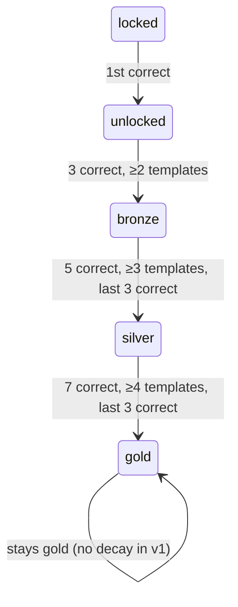

# Achievements

> The achievement grid IS the memory palace map.

Achievements in evo-quest are not generic trophies. Each is a
*topic-shaped piece of the idea itself* — a small concrete object the
student can revisit as a mnemonic for the concept they earned it from.
The grid on the home page literally is the conceptual taxonomy of high
school biology, collapsed to one emoji + one word per cell. As the
student fills it in, they're filling in their own mental map of the
field.

---

## 1. Design language rules

Every achievement obeys these rules. PRs that violate them are returned
to the author.

### 1.1 Topic-shaped iconography

The emoji must depict the *thing* the unit is about, not a reward.

| ✅ Good | ❌ Bad |
|---|---|
| ⚗️ for Miller-Urey | 🏆 for any unit |
| 🧬 for endosymbiosis | ⭐ for any unit |
| 🌸 for incomplete dominance | 💯 for any unit |
| 🦒 for Lamarck-vs-Darwin | 🥇 for any unit |
| 🦴 for vertebrate origins | 🎖️ for any unit |
| ⏳ for deep time | 🎯 for any unit |

Stars, trophies, medals, targets, fire emojis (for streaks), and rosettes
are reserved for *aggregate* achievements (§5) — never per-unit.

### 1.2 Short label: 1-2 words

Fits in a 60×60 px tile with the emoji. Examples:

- ⚗️ **Miller-Urey** (one word)
- 🧬 **Endo-sym** (hyphenated abbreviation)
- 🌸 **Incomplete** (one word)
- 🦒 **Lamarck?** (with a punctuation hook for the binary-choice unit)

Bad short labels:

- ⚗️ "**The Miller-Urey Experiment**" (too long)
- ⚗️ "**Origins**" (too generic)
- ⚗️ "**Got It!**" (no topic content)

### 1.3 Long label: 2-6 words

Used on the Journeys page detail view.

- ⚗️ "**The Miller-Urey Apparatus**"
- 🧬 "**Endosymbiotic Theory**"
- 🌸 "**Incomplete Dominance**"

### 1.4 Flavor: one second-person present-tense sentence

The flavor *narrates the idea*, not the student's act of getting it right.

| ✅ Good | ❌ Bad |
|---|---|
| "*Lightning strikes the flask. Amino acids precipitate.*" | "You got Miller-Urey right!" |
| "*Mitochondria slip inside. They never leave.*" | "Nice job remembering endosymbiosis." |
| "*Pink. Not red, not white — pink. Neither allele yielded.*" | "Correct! Incomplete dominance is when neither allele is dominant." |
| "*Stretched necks die with their owners. Born long necks live on.*" | "Lamarck was wrong about giraffes." |

Length: ≤140 characters so it fits in a single short paragraph in the
feedback panel.

### 1.5 Wing palette

Every achievement carries its Wing's color palette (see
[`aesthetic.md`](./aesthetic.md)):

| Wing | Primary | Secondary | Vibe |
|---|---|---|---|
| Evolution | amber `#fbbf24` | orange `#fb923c` | warmth, sun, time |
| Origin of Life | violet `#a78bfa` | lavender `#c4b5fd` | primordial mystery |
| Cell Biology | cyan `#22d3ee` | green `#34d399` | water, life |
| Genetics | magenta `#e879f9` | pink `#f472b6` | Mendel's garden |
| Ecology (future) | emerald `#10b981` | lime `#65a30d` | forest |
| Anatomy (future) | rose `#f43f5e` | coral `#fb7185` | flesh |
| Biochem (future) | blue `#3b82f6` | indigo `#6366f1` | molecular |

The Wing palette is the achievement tile's gradient when unlocked.

---

## 2. The home grid

```
─────────────────── EVOLUTION ────────────────────
⏳         ⚗️         🧬         🌋         🦒
Deep Time  Miller-U.  Endo-sym   Cambrian   Lamarck?

🐢         🌊         🪲         📈         🔥
Galápagos  Drift      Mimicry    Selection  Permian

────────────────── CELL BIOLOGY ──────────────────
🧫         🧬         🪟         ⚡         🔋
Cell Th.   Mitoch.    Membrane   ETC        ATP

(etc.)
```

Visual notes:

- 1px subtle dividers between rooms
- 2px gradient bands between Wings
- Locked tiles: ghost outline + dim emoji
- Unlocked tiles: full color with Wing palette glow
- Mastery tier: ring around tile (no ring=unlocked, thin bronze, medium silver, thick gold)
- Hidden achievements: don't appear until earned (slot is blank)
- Aggregate achievements: appear larger at the top of each group

Tap interactions:

- Locked → small popover showing the unit's `teach.headline` + an
  **Embark this unit** button (1-question micro-journey)
- Unlocked → popover with the flavor text + **Revisit** + tier history
- Aggregate → shows what's needed to complete the group

---

## 3. Per-Wing example catalogs

Concrete examples for each v1 Wing. Authors should pattern-match these.

### 3.1 Evolution

| Unit | Achievement | Flavor |
|---|---|---|
| `evo.origin.miller-urey` | ⚗️ **Miller-Urey** | *Lightning strikes the flask. Amino acids precipitate.* |
| `evo.origin.primordial-soup` | 🍲 **Soup** | *The early ocean thickens. Carbon is restless.* |
| `evo.origin.rna-world` | 🪞 **RNA First** | *A molecule that copies itself, AND folds into a tool.* |
| `evo.origin.endosymbiosis` | 🧬 **Endo-sym** | *Mitochondria slip inside. They never leave.* |
| `evo.selection.natural` | 📈 **Selection** | *Variation existed first. The environment kept score.* |
| `evo.selection.directional` | ➡️ **Directional** | *The bell curve shifts. One extreme wins.* |
| `evo.selection.stabilizing` | ⚖️ **Stabilizing** | *The middle survives. The edges thin.* |
| `evo.selection.disruptive` | ✂️ **Disruptive** | *Two peaks. The middle collapses.* |
| `evo.selection.sexual` | 🦚 **Sexual** | *Beauty kills predators. Beauty kills more anyway.* |
| `evo.evidence.galapagos` | 🐢 **Galápagos** | *One ancestor, thirteen finches, a hundred islands.* |
| `evo.evidence.fossils` | 🦴 **Fossils** | *Stone remembers what bone forgets.* |
| `evo.evidence.homology` | 🤚 **Homology** | *Your hand and a whale's flipper are the same poem.* |
| `evo.evidence.analogy` | 🦋 **Analogy** | *Bats and birds. Same job, different blueprints.* |
| `evo.evidence.embryology` | 🧒 **Embryos** | *Vertebrate embryos look alike before they don't.* |
| `evo.speciation.allopatric` | 🏝️ **Allopatric** | *A river cuts. Two species are born.* |
| `evo.speciation.sympatric` | 🌳 **Sympatric** | *Same forest, different niches, separate fates.* |
| `evo.speciation.adaptive-radiation` | ☀️ **Radiation** | *One ancestor, many forms, a sunburst of life.* |
| `evo.evidence.lamarck` | 🦒 **Lamarck?** | *Stretched necks die with their owners. Born long necks live on.* |
| `evo.deep-time.cambrian` | 🌋 **Cambrian** | *Suddenly: eyes, limbs, claws, shells, body plans.* |
| `evo.deep-time.permian` | 🔥 **Permian** | *95% of species, gone. The Great Dying.* |
| `evo.deep-time.k-pg` | ☄️ **K-Pg** | *A rock from space ends the age of dinosaurs.* |
| `evo.deep-time.deep-time` | ⏳ **Deep Time** | *Four and a half billion years. You are recent.* |

### 3.2 Cell Biology

| Unit | Achievement | Flavor |
|---|---|---|
| `cell.theory.cell-theory` | 🧫 **Cell Theory** | *All life is cells. All cells come from cells.* |
| `cell.theory.prokaryote-vs-eukaryote` | 🦠 **Pro-vs-Eu** | *Membrane-bound nucleus or not. The fundamental fork.* |
| `cell.organelles.nucleus` | 🧠 **Nucleus** | *The cell's library. DNA stays inside; mRNA goes out.* |
| `cell.organelles.mitochondrion` | ⚡ **Mitoch.** | *Once a free-living bacterium. Now your power plant.* |
| `cell.organelles.chloroplast` | 🌿 **Chloro.** | *Sunlight + water + CO₂ = sugar. Done by a former bacterium.* |
| `cell.organelles.ribosome` | 🧱 **Ribosome** | *Where mRNA gets read into protein. Every cell has them.* |
| `cell.organelles.endoplasmic-reticulum` | 🪡 **ER** | *The protein folding factory. Rough = ribosomes attached.* |
| `cell.organelles.golgi` | 📦 **Golgi** | *The cell's post office. Modify, sort, ship.* |
| `cell.organelles.lysosome` | 🧹 **Lysosome** | *The cell's recycling pit. Acidic. Digestive.* |
| `cell.membrane.phospholipid-bilayer` | 🪟 **Bilayer** | *Two sheets of phospholipids. Heads out, tails in.* |
| `cell.membrane.fluid-mosaic` | 🌊 **Mosaic** | *Proteins drift in the lipid sea. Nothing is rigid.* |
| `cell.membrane.osmosis` | 💧 **Osmosis** | *Water flows toward solutes. Cells swell or shrink.* |
| `cell.membrane.diffusion` | 🌬️ **Diffusion** | *Particles spread. Entropy always wins.* |
| `cell.membrane.active-transport` | 🚪 **Active** | *Against the gradient. Costs ATP.* |
| `cell.energy.glycolysis` | 🍬 **Glycolysis** | *Glucose splits in two. Two ATP, two pyruvate.* |
| `cell.energy.krebs` | 🔄 **Krebs** | *Eight steps, around and around. CO₂ comes out.* |
| `cell.energy.etc` | ⚡ **ETC** | *Electrons cascade. Protons pump. ATP appears.* |
| `cell.energy.atp` | 🔋 **ATP** | *Three phosphates. Snap one off. Power.* |
| `cell.energy.photosynthesis` | ☀️ **Photo.** | *Light splits water. Carbon gets fixed. Sugar appears.* |
| `cell.cycle.mitosis` | 🪞 **Mitosis** | *One cell becomes two. Both identical. Every body cell.* |
| `cell.cycle.meiosis` | 🎰 **Meiosis** | *One cell becomes four. All unique. Eggs and sperm.* |
| `cell.cycle.checkpoints` | 🛑 **Checkpoints** | *The cell pauses. Is the DNA okay? Proceed or die.* |

### 3.3 Genetics

| Unit | Achievement | Flavor |
|---|---|---|
| `gen.mendel.law-of-segregation` | 🌱 **Segregation** | *Two alleles. One in each gamete. Mendel's first law.* |
| `gen.mendel.law-of-independent-assortment` | 🎲 **Independent** | *Different genes shuffle separately. Mendel's second law.* |
| `gen.mendel.dominant-recessive` | 👑 **Dominant** | *One allele speaks. The other waits its turn.* |
| `gen.mendel.test-cross` | 🧪 **Test Cross** | *Cross with a homozygous recessive. Read the babies.* |
| `gen.exceptions.incomplete-dominance` | 🌸 **Incomplete** | *Pink. Not red, not white — pink. Neither allele yielded.* |
| `gen.exceptions.codominance` | 🐔 **Codominance** | *Both alleles speak. Both phenotypes show. Black AND white.* |
| `gen.exceptions.multiple-alleles` | 🩸 **Multi-Allele** | *A, B, O — three alleles for one gene. The blood type story.* |
| `gen.exceptions.polygenic` | 🎨 **Polygenic** | *Many genes, one trait. Skin, height, intelligence.* |
| `gen.exceptions.epistasis` | 🪟 **Epistasis** | *One gene masks another. The labrador coat color trick.* |
| `gen.sex-linked.karyotype` | 📸 **Karyotype** | *The family photo of your chromosomes. 22 + XX or 22 + XY.* |
| `gen.sex-linked.x-linked-recessive` | 👁️ **X-Linked R.** | *Males have one X. One bad copy is enough.* |
| `gen.sex-linked.colorblindness` | 🌈 **Color-blind** | *Mother carrier, son affected. Granddad to grandson, hidden.* |
| `gen.sex-linked.hemophilia` | 🩸 **Hemophilia** | *Royal blood, royal disease. The Romanovs knew.* |
| `gen.pedigrees.symbols` | 📊 **Pedigree** | *Squares and circles. Filled and empty. Generations down.* |
| `gen.pedigrees.identify-pattern` | 🔍 **Detective** | *Count affected by sex. Test each hypothesis. One survives.* |
| `gen.dna.structure` | 🪜 **Double Helix** | *Two strands, antiparallel, hydrogen-bonded, twisted.* |
| `gen.dna.replication` | 🪞 **Replication** | *Each strand templates a new partner. Semiconservative.* |
| `gen.protein.transcription` | 📝 **Transcribe** | *DNA to mRNA. T becomes U. Inside the nucleus.* |
| `gen.protein.translation` | 🧬 **Translate** | *Codons to amino acids. tRNAs deliver. Ribosome reads.* |
| `gen.protein.central-dogma` | 📜 **Dogma** | *DNA → RNA → Protein. The flow of biological information.* |
| `gen.mutation.point` | ✏️ **Point** | *One base swapped. Silent, missense, or nonsense.* |
| `gen.mutation.frameshift` | 🔀 **Frameshift** | *Insert or delete. Every codon downstream is wrong.* |
| `gen.mutation.sickle-cell` | 🩸 **Sickle** | *One amino acid change. Catastrophe. Also: malaria resistance.* |
| `gen.engineering.crispr` | ✂️ **CRISPR** | *Bacteria's immune system, repurposed as genetic scissors.* |
| `gen.engineering.gmo` | 🌽 **GMO** | *Bt corn. Golden rice. The genome as a workbench.* |

---

## 4. Mastery tiers



Visual representation on each tile:

| Tier | Ring | Glow |
|---|---|---|
| `locked` | none | none (ghost outline) |
| `unlocked` | none | soft Wing palette glow |
| `bronze` | 1px bronze (`#c87a2f`) ring | same glow + faint warm undertone |
| `silver` | 2px silver (`#d1d5db`) ring | brighter glow |
| `gold` | 3px gold (`#fbbf24`) ring with subtle pulse | full glow + golden particles when in view |

Mastery tier transitions trigger their own celebratory animation —
shorter than the first-unlock celebration, but distinct.

### 4.1 Why no decay?

V1 explicitly does not decay mastery tiers. Decay would punish students
for studying *new* material instead of cycling old. The trouble-tour
review mode (engine.md §4.3) is the spaced-repetition mechanism — it
surfaces drift naturally without taking away earned tiles.

V2 may add an *optional* spaced-repetition mode that visualizes drift
without removing tiers.

---

## 5. Aggregate achievements

When every unit under a Drawer/Room/Wing reaches `unlocked`, a larger
aggregate tile is awarded at the top of that group.

### 5.1 Drawer aggregates

A Drawer aggregate is *thematic* — a single richer emoji + a 2-3 word
label + a longer flavor.

Example: completing all 6 units in `evo.selection` Drawer:

> 🌍 **The Selector** — *You see Darwin's lens. Variation, inheritance, differential reproduction — the engine of evolution.*

### 5.2 Room aggregates

Completing all Drawers in a Room → a Room aggregate. Bigger, more
flourish.

Example: `evo.evidence` Room (Galápagos + Fossils + Homology + Analogy + Embryology):

> 📚 **Evidence-Reader** — *You have learned to read evolution from rocks, bones, embryos, and living forms.*

### 5.3 Wing aggregates

Completing every Room in a Wing → a Wing aggregate. The largest tile,
with custom artwork beyond simple emoji.

Example: complete all of Evolution:

> 🧬⏳📈 **Darwin's Apprentice** — *You now think in terms of variation, selection, and deep time. The biosphere makes sense.*

### 5.4 World aggregate

Completing every Wing → the World aggregate:

> 🌎 **Biologist** — *Information has become knowledge. Welcome.*

The World aggregate is the literal end-state of v1. There's no "level
2" — once a student has earned this, they have completed evo-quest.

---

## 6. Hidden achievements

Cross-cutting, surprise-on-unlock. Not visible until earned.

| ID | Trigger | Reveal |
|---|---|---|
| `hidden.lamarcks-ghost` | Identify Lamarckian-sneak bug in `debug-the-claim` 3 times in a row | 🦒 **Lamarck's Ghost** — *You can spot him in modern writing.* |
| `hidden.etymologist` | Encounter 20 distinct morphemes | 📜 **Etymologist** — *You read Greek and Latin through biology.* |
| `hidden.morphologist` | Encounter 50 distinct morphemes | 🏛️ **Morphologist** — *Every term decomposes for you now.* |
| `hidden.bricoleur` | Save 5 artifacts to the Lab Notebook | 🛠️ **Bricoleur** — *You build to think. The materials taught back.* |
| `hidden.master-builder` | Save 20 artifacts | 🏗️ **Master Builder** — *Your notebook is a museum.* |
| `hidden.calibrator` | Brier score ≤ 0.15 over 30 self-debug-confidence attempts | 🎯 **Calibrator** — *You know what you know. And what you don't.* |
| `hidden.palace-walker` | Complete every room in a Wing using only `palace-walk` | 🚶 **Palace Walker** — *Spatial cognition is older than language. You used both.* |
| `hidden.roommate` | Get the endosymbiosis unit to gold | 🧬 **Roommate** — *Two billion years of cohabitation. Worth a celebration.* |
| `hidden.first-builder` | Build a correct Punnett 4×4 | 🌱 **First Builder** — *Sixteen cells, four phenotypes, one law.* |
| `hidden.tinker` | Use `microworld-sandbox` for ≥10 min in one session | 🔧 **Tinker** — *Bricolage in the original sense — courses of action found in materials.* |
| `hidden.parsimony` | Reach optimal parsimony score on first try in `cladogram-crafter` | 🌳 **Parsimony** — *The simplest tree that fits the data. You saw it.* |
| `hidden.cascade-prophet` | Predict 3 food-web cascades correctly in a row | 🌊 **Cascade Prophet** — *You see the second-order effects.* |
| `hidden.counterfactual` | Complete a `counterfactual-lab` with the canonical chain on first try | 🤔 **Counterfactual** — *History could have been otherwise. You see how.* |
| `hidden.streak-15` | 15 correct in a row in one journey | 🔥 **On Fire** — *Fifteen in a row. The neurons are warmed up.* |
| `hidden.streak-25` | 25 correct in a row in one journey | 🌋 **Eruption** — *Twenty-five. The expert state.* |
| `hidden.daily-7` | 7-day study streak | 📅 **Habit** — *Seven days running. The practice has become a rhythm.* |
| `hidden.daily-30` | 30-day study streak | 🎓 **Discipline** — *Thirty days. You are someone who studies biology.* |
| `hidden.zero-power-up` | Complete a 15+ unit journey at ≥80% without using any power-up | 🦅 **Unaided** — *No shortcuts. The achievement was the work.* |

Hidden achievements appear in the journeys page **after** earning, with
a brief delay (so the celebration feels discovered).

---

## 7. Achievement animations

### 7.1 First unlock

```
0ms   – tile fades from ghost outline → full color
200ms – tile dilates from 1.0 to 1.15 over 200ms
400ms – tile pulses back to 1.0
400ms – Wing-palette glow ring expands outward 80px and fades
500ms – flavor text slides up below tile (slideUp)
600ms – audio sting: `unlock` (arpeggio + shimmer tail)
```

Total: ~1.5s. Brief, satisfying, never blocks input.

### 7.2 Tier transition (bronze → silver, etc.)

Subtler:

```
0ms   – tile holds
100ms – ring transitions in width + color over 300ms
200ms – brief sparkle particle (3 particles) on tile corners
300ms – audio: shorter version of `unlock` sting (no shimmer tail)
```

Total: ~600ms.

### 7.3 Aggregate unlock

Bigger:

```
0ms   – all the contributing tiles pulse simultaneously
200ms – contributing tiles rotate slightly toward the aggregate position
400ms – aggregate tile materializes with confetti burst
1000ms – flavor text slides up, larger
1200ms – audio: longer 4-chord sting
```

Total: ~2.5s. The student should *feel* this one.

### 7.4 Reduced-motion alternative

Each animation has a non-motion version:

- Color transitions only (no scaling, no rotation)
- Confetti replaced with a static "✨" character cascade
- Particles replaced with a brief opacity fade

---

## 8. The "tap a locked tile" interaction

Locked tiles aren't just decoration — they're entry points.

```
┌──────────────────────────────────────────┐
│  ⚗️ MILLER-UREY                          │
│                                          │
│  Stanley Miller showed lightning could   │
│  produce amino acids in a flask of       │
│  early-Earth gases. 1953.                │
│                                          │
│   [   ⚡ Embark this one   ]              │
└──────────────────────────────────────────┘
```

A one-tap shortcut to a 1-unit micro-journey. Specifically:

- The session machine creates an ad-hoc `SelectionDescriptor` of
  `{ kind: 'branch', nodeId: unitId }`
- Queue length 1
- Mood: whichever the Settings default is
- On completion, returns to the same page with the tile newly unlocked
  (and the cascade of animations fires)

This is the "every locked door is also a doorbell" pattern — the home
page invites exploration without forcing structured journeys.

---

## 9. Anti-patterns

Things authors and reviewers must catch:

- **Numeric labels**: "Cells 1", "Cells 2", "Cells 3" — no. The
  achievement should be the thing, not the count.
- **Verb labels**: "Mastered Mitosis" — no. Just "Mitosis".
- **Praise in flavor**: "Great work on mitosis!" — no. Narrate the
  *idea*, not the student.
- **Naming the app** in flavor: "You have made evo-quest part of your
  week" — no. Refer to the practice or the idea, not the software.
- **App-feature names in flavor**: "Your speed-reveal mastery is
  growing" — no. The student never sees internal feature names. Use
  in-world language ("the work", "the practice", "the materials").
- **Praising the inspirations to praise the student**: "Papert would
  smile" — no. Find a non-authority phrasing for the idea itself.
- **Genericism**: a 🏆 trophy for any unit is forbidden. Find the right
  topic-shaped emoji or commission custom SVG.
- **Emoji collisions** (rare): two units with the same emoji + similar
  label confuse the grid. Run a build-time uniqueness check on
  `(emoji, shortLabel)` pairs and fail builds on collision.
- **Hidden bloat**: more than ~20 hidden achievements in v1 turns them
  into noise. Each must be genuinely surprising and topic-rooted.

---

## 10. Authoring checklist

Before adding a new unit's achievement, an author confirms:

- [ ] Emoji is topic-shaped (not a generic reward symbol)
- [ ] `shortLabel` is ≤14 chars, 1-2 words
- [ ] `longLabel` is ≤40 chars
- [ ] `flavor` is one second-person present-tense sentence ≤140 chars
- [ ] `flavor` narrates the *idea*, not the student's action
- [ ] `wingId` matches the unit's Wing
- [ ] No collision with another unit's `(emoji, shortLabel)` pair
- [ ] If aggregate-eligible (last unit of a Drawer/Room/Wing), the
      parent's aggregate achievement is also defined

---

## 11. The "Memory Palace Walk-Through" view

A planned (v1.1) feature: tap a Wing aggregate → enter a guided tour
through every unlocked unit in the Wing, flavor-text by flavor-text, as
a narrated coherent story. The student literally re-walks their palace.

This is what makes the achievement system meaningful: at the end, the
student can take a *narrative tour* of what they've learned, each room
introduced by their own earned flavor. The achievement set has become
the lesson.
