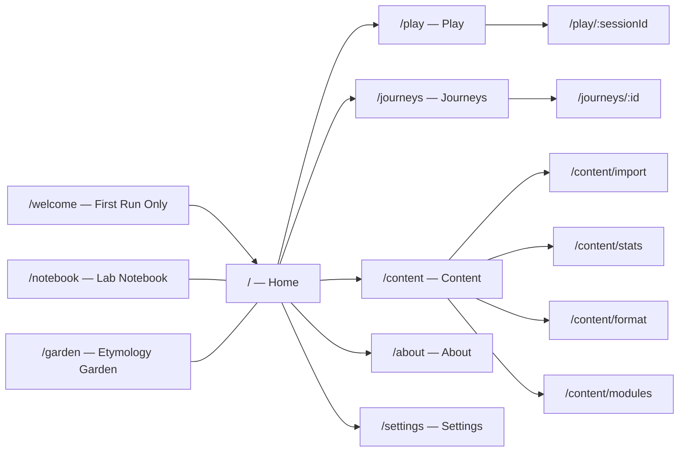
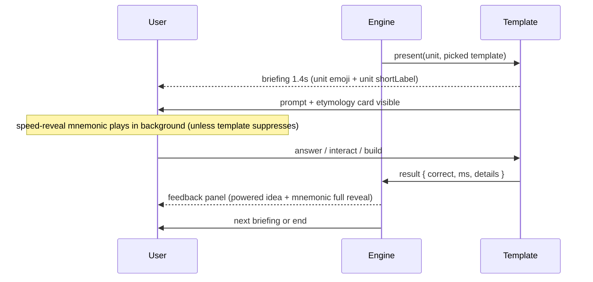
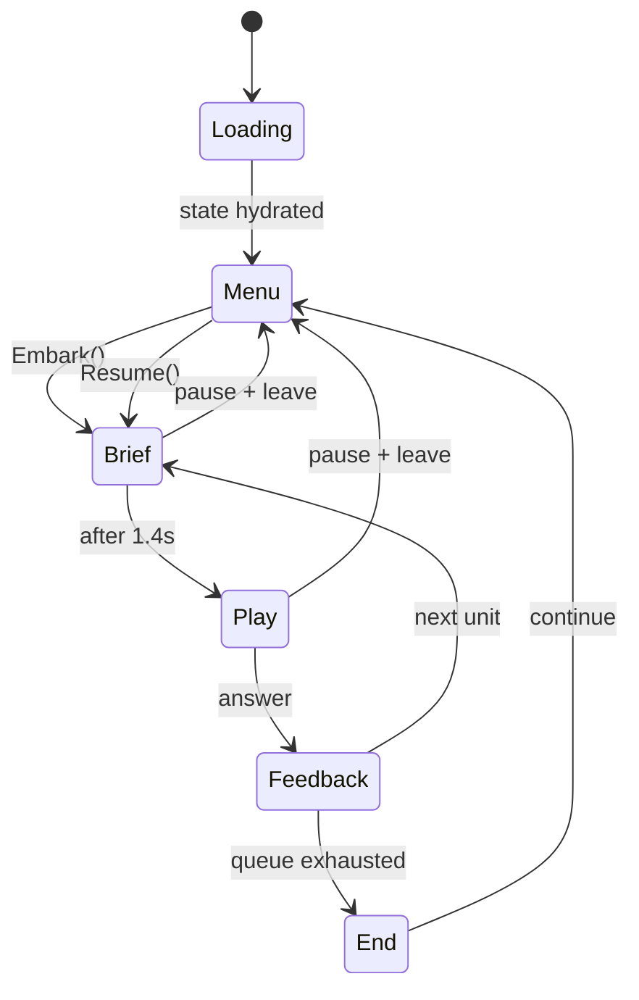

# evo-quest — App Design Document

> "Powerful ideas in mind-size bites." — Seymour Papert
>
> "Simple things should be simple. Complex things should be possible." — Alan Kay

This is the source-of-truth design doc for evo-quest. The execution plan
lives in `.cursor/plans/` and the game-type design specs live in
[`../game-types/`](../game-types/). This document expands the *what* —
every sub-feature, every page, every invariant.

---

## Contents

0. [North Star](#0-north-star)
1. [Information Architecture](#1-information-architecture)
2. [The Memory Palace (content hierarchy)](#2-the-memory-palace)
3. [The Knowledge Unit (atomic cell)](#3-the-knowledge-unit)
4. [Game Type Engine](#4-game-type-engine)
5. [Etymology & Morpheme Registry](#5-etymology--morpheme-registry)
6. [Achievements System](#6-achievements-system)
7. [Journeys (session log)](#7-journeys-session-log)
8. [Pages, in detail](#8-pages-in-detail)
9. [The HUD](#9-the-hud)
10. [Power-Ups](#10-power-ups)
11. [Storage & Resume](#11-storage--resume)
12. [Content Modules (extensibility)](#12-content-modules-extensibility)
13. [Content Management Console](#13-content-management-console)
14. [The Lab Notebook (persistent artifacts)](#14-the-lab-notebook)
15. [The Etymology Garden](#15-the-etymology-garden)
16. [Aesthetic System](#16-aesthetic-system)
17. [Audio Design](#17-audio-design)
18. [Animations & Motion](#18-animations--motion)
19. [Accessibility](#19-accessibility)
20. [Responsive & Touch](#20-responsive--touch)
21. [Onboarding](#21-onboarding)
22. [Settings](#22-settings)
23. [State Management & Architecture](#23-state-management--architecture)
24. [TanStack Start Specifics](#24-tanstack-start-specifics)
25. [Cloudflare Deployment](#25-cloudflare-deployment)
26. [CI / CD](#26-ci--cd)
27. [Testing Strategy](#27-testing-strategy)
28. [Privacy & Data Ownership](#28-privacy--data-ownership)
29. [Curriculum Coverage (v1 + future)](#29-curriculum-coverage)
30. [Authoring Workflow](#30-authoring-workflow)
31. [Coding Conventions](#31-coding-conventions)
32. [Error Handling](#32-error-handling)
33. [Performance Budget](#33-performance-budget)
34. [The Papert Test](#34-the-papert-test)
35. [The Kay Test](#35-the-kay-test)
36. [Roadmap Beyond v1](#36-roadmap-beyond-v1)

---

## 0. North Star

evo-quest's job is to convert **information** into **knowledge** for a high
school biology student. We measure success by three properties of a typical
30-minute session:

1. **Lift in active recall** — the student can produce the term/concept
   unprompted afterward, not just recognize it.
2. **Mnemonic adhesion** — for any technical term encountered, the student
   carries away a vivid linkage (etymology + image) that survives weeks.
3. **Affective pull toward biology** — the student *wants* to come back. The
   loop is fun in the Papertian "hard fun" sense; achievements feel earned
   and conceptually meaningful.

What we explicitly do *not* optimize for:

- Maximizing quiz volume — we'd rather two well-revealed questions than ten
  surface-skim multiple choices.
- Gamification-for-its-own-sake — every game element must tie to a
  conceptual hook (topic-shaped power-ups, topic-shaped achievements).
- Lock-in — the student owns their data, can export it, can delete it.
  Local-first by default.

---

## 1. Information Architecture

### 1.1 Sitemap



### 1.2 Route map

| Route | Purpose | Loader needs | SSR? |
|---|---|---|---|
| `/` | Home: concise achievement grid + Continue/New Quest | content tree + saved state | yes (skeleton) |
| `/welcome` | First-run onboarding (3 screens) | none | yes |
| `/play/:sessionId` | The active study session | session payload from storage | client-only (live state) |
| `/journeys` | Journey timeline + Embark panel + detailed achievements | journeys log + stats | yes |
| `/journeys/:id` | One past journey, replay & detail | one journey record | yes |
| `/content` | Content management dashboard | enabled modules + stats | yes |
| `/content/import` | Paste-JSON-to-import-content flow | none | yes |
| `/content/format` | Schema-rendered format docs + AI prompt blurbs | the live Zod schema | yes |
| `/content/stats` | Per-branch trouble stats | journeys log → aggregated | yes |
| `/content/modules` | Toggle bundled + user modules | module registry | yes |
| `/notebook` | Lab notebook: saved artifacts (Punnett, concept maps, food webs, procedure builds) | artifact log | yes |
| `/garden` | Etymology garden: morphemes collected, cross-linked | morpheme registry + log | yes |
| `/about` | Credits to Papert/Kay, philosophy, "why this app" | static | yes |
| `/settings` | Accessibility, audio, theme, data export/import, hard reset | settings + storage | yes |

### 1.3 Navigation patterns

- **Always-visible**: an unobtrusive bottom bar on mobile (Home, Play,
  Journeys, Content, More); a left rail on ≥768px wide.
- **Resume nudge**: when a saved session exists, the Home page and any other
  page show a *floating "Resume"* pill in the bottom-right. Dismissable
  per-page but persistent across the app until acted on.
- **Breadcrumbs**: inside `/content/*` and `/journeys/:id`. Nowhere else —
  the rest is shallow.
- **No back-button traps**: every transient overlay (confirm dialogs,
  power-up usage) is closeable by Escape, backdrop click, or the OS back
  button on Android.

---

## 2. The Memory Palace

The content tree is a 4-deep hierarchy with the same recursive shape at
every level. Each node carries the same fields: `id`, `slug`, `title`,
`emoji?`, `description?`, and children of the next type.

### 2.1 Tree shape

```
World
└── Wing                 — broad domain ("Evolution", "Cell Biology")
    └── Room             — major theme ("Origin of Life", "Natural Selection")
        └── Drawer       — focused sub-theme ("Abiogenesis", "Selection Modes")
            └── KnowledgeUnit  — atomic teaching cell
```

### 2.2 Naming convention

Stable IDs are dotted paths that match the tree:

- Wing: `evo` (Evolution), `cell` (Cell Biology), `gen` (Genetics)
- Room: `evo.origin` (Origin of Life within Evolution)
- Drawer: `evo.origin.abiogenesis`
- Unit: `evo.origin.abiogenesis.miller-urey`

These IDs are **immutable** once shipped. If renamed for human reasons, the
old ID stays as an `aliases: string[]` so saved state and journey logs can
still resolve. See §11 for the resume contract.

### 2.3 Why this shape

- **Kay-pleasing self-similarity**: the same node interface at every depth
  means one rendering component handles all four levels — late-bound,
  recursive, simple.
- **Memory palace mapping**: the user's spatial intuition is "Wing → Room →
  Drawer → Box of cards" — language students already use. The metaphor isn't
  surfaced as decoration; it's the actual taxonomy.
- **Stats roll up naturally**: accuracy at Drawer = aggregate of its Units.
  Trouble flag at Room = max trouble across its Drawers. All in one
  reduce operation.

---

## 3. The Knowledge Unit

The atomic cell. Everything teaches and tests one unit.

### 3.1 Schema

```ts
type KnowledgeUnit = {
  id: string;                            // "evo.origin.abiogenesis.miller-urey"
  aliases?: string[];                    // for ID renames; never removed
  slug: string;                          // url-safe short name
  title: string;                         // "Miller-Urey Experiment"
  emoji: string;                         // "⚗️"
  shortLabel: string;                    // for the dense home grid ("Miller-Urey")
  longLabel: string;                     // for the journeys page ("The Miller-Urey Experiment")
  description?: string;                  // 1-2 sentence summary for hovers

  teach: TeachBlock;                     // the learning content (what the student reads/sees)
  quizzes: QuizTemplate[];               // 1+ ways to assess this unit
  achievement: Achievement;              // exactly one topic-shaped achievement
  prerequisites?: string[];              // KnowledgeUnit ids; soft suggestion not a wall
  difficulty?: 'intro' | 'core' | 'deep'; // for selection algorithms

  enabled: boolean;                      // meta toggle (per content management)
  authorNotes?: string;                  // never shown to students; for content reviewers
};
```

### 3.2 Teach block

The content the student reads/sees *before* (or *instead of*) the quiz, on
first encounter and on review:

```ts
type TeachBlock = {
  headline: string;                      // bold one-liner ("Lightning + Soup = Amino Acids")
  body: string;                          // markdown, 1-3 short paragraphs
  etymology?: Etymology;                 // for any key term
  mnemonic?: string;                     // the speed-revealable phrase
  poweredIdea: string;                   // the one-sentence powerful idea
  imageUrl?: string;                     // optional illustration
  cite?: string[];                       // citations/sources
};
```

The teach block is shown in three places:

1. Brief preface before the quiz on first encounter
2. The feedback panel after answering (right or wrong)
3. The Journeys page achievement detail

### 3.3 Quiz array

A unit can carry any subset of the 17 game-type templates (see
[`../game-types/00-index.md`](../game-types/00-index.md)). The engine picks
one per encounter:

- **Random**: default — uniform over available templates
- **Preferred**: any template with `preferred: true` is favored on first
  encounter
- **Variety bias**: subsequent encounters bias toward templates the student
  hasn't yet seen for *this unit* — same powerful idea, different angle
- **Mode override**: review journeys (trouble, wrong-only) can force a
  specific template kind

### 3.4 Achievement

Exactly one per unit (see §6 for the design language). The achievement is
the unit's "topic-shaped trophy" — the mitochondrion icon for the
mitochondrion unit, the dichotomous-key fork for the dichotomous-key unit.

### 3.5 Etymology

```ts
type Etymology = {
  termId: string;                        // unique across the registry
  term: string;                          // "endosymbiosis"
  morphemes: MorphemeRef[];              // [endo, sym, bio, -sis]
  rootSummary: string;                   // "Greek: endo + sym + bios"
};

type MorphemeRef = {
  morphemeId: string;                    // references the global registry (§5)
  asUsed: string;                        // the surface form in this term
};
```

### 3.6 Mnemonic

The string that animates in via the speed-reveal pattern. ≤140 chars.
Conventions in `01-speed-reveal-mnemonic.md`. Authoring rule of thumb:
ALL-CAPS the morpheme→hook mapping ("ENDO=INSIDE") and end with a vivid
image ("roommates for 2 billion years").

---

## 4. Game Type Engine

### 4.1 Template registry

Single source of truth: `src/engine/templates/index.ts` registers one entry
per game-type file in `plan/game-types/`. The registry exposes:

```ts
type TemplateRegistration = {
  kind: string;                          // matches the game-types filename stem
  schema: ZodSchema;                     // for validating import + saved state
  Renderer: ComponentType<TemplateProps>;
  Briefing: ComponentType<{ data: unknown }>;
  exemplar: unknown;                     // a working example used in format docs
  fastLane: boolean;                     // can be used for ≤60s questions?
  microworld: boolean;                   // is this a deep mode (≥3 min)?
  needsServer?: false;                   // all v1 templates are client-side
};
```

A new game type drops a single file `src/engine/templates/<kind>.tsx` that
exports a `TemplateRegistration`. The registry collects them at build time
by `import.meta.glob`. No central list to update.

### 4.2 Selection: random vs specified

Within a journey, the engine calls `pickTemplate(unit, history, mode)`:

- `mode = 'random'` — uniform over `unit.quizzes`
- `mode = 'preferred'` — picks a `quiz.preferred === true` if present, else random
- `mode = 'variety'` — biases toward unseen kinds for this unit
- `mode = 'force:<kind>'` — overrides everything (used by trouble-review)

### 4.3 Selection: which units to study

The "Embark" panel offers six selection modes (see §7.2 for full UX):

| Mode | What it picks |
|---|---|
| `quick-mix` | 10-15 units uniformly across enabled content, fast-lane templates only |
| `deep-dive` | 4-6 units in a chosen branch, microworld templates allowed |
| `trouble` | units with accuracy < 60% over last 5 attempts |
| `wrong-only` | units the student got wrong in the last completed journey |
| `mixed-trouble` | one trouble unit + 3-4 related units (same Drawer/Room) — context recovery |
| `branch` | every enabled unit in a chosen Wing/Room/Drawer |
| `journey-replay` | re-run a past journey with the same units, fresh shuffle |

### 4.4 Cross-template reveal & feedback patterns

Every template, regardless of kind, follows the same outer rhythm:



The shared components are:

- `<Briefing>` — 1.4s gradient title card. Shows the **unit's emoji +
  shortLabel** (the topic, e.g. "⚗️ Miller-Urey"), never the
  game-type's internal name. The interaction itself is the introduction
  to the format; the briefing is the introduction to the *idea*.
- `<HudBar>` — persistent during play (see §9)
- `<EtymologyCard>` — sticky on the side / below the prompt
- `<MnemonicReveal>` — overlay or inline depending on screen size
- `<FeedbackPanel>` — after-question recap

Game-type-specific UI sits **inside** these — the rhythm is invariant.

> **Copy invariant**: nowhere in the play loop does the student see the
> internal name of a game type (e.g., "Speed Reveal Mnemonic",
> "Microworld Sandbox", "Punnett Builder"). Those names are
> developer-facing. The student experiences the *interaction*; the
> *topic* is what's labeled.

---

## 5. Etymology & Morpheme Registry

The morpheme registry is a shared, cross-unit, app-global resource. Once a
student touches a morpheme in any unit, the registry remembers — and that
morpheme glows softly the next time it appears anywhere.

### 5.1 Structure

```ts
type Morpheme = {
  id: string;                            // "morph.endo"
  morpheme: string;                      // "endo"
  language: 'Greek' | 'Latin' | 'Other';
  meaning: string;                       // "within"
  cousins?: string[];                    // morpheme ids with related meaning ("ento", "intra")
  appearsIn: string[];                   // KnowledgeUnit ids (computed at build time)
};
```

### 5.2 Learning state per morpheme

```ts
type MorphemeProgress = {
  morphemeId: string;
  firstSeenAt: number;                   // ms epoch
  encounters: number;
  correctEncounters: number;
  lastSeenAt: number;
};
```

Stored as `evo-quest.v1.morphemes`. Drives the Etymology Garden page (§15).

### 5.3 Cross-context glow

Anytime a morpheme appears in a quiz (etymology card, etymology-puppet
palette, mnemonic, term in a fill question), if the registry shows
`encounters > 0`, the morpheme renders with a subtle violet outer-glow.

The glow says: *you've met this part before*. It's the visible mortar of
the curriculum's coherence.

### 5.4 Authoring etymology entries

Authors don't write morpheme objects directly. They write etymologies on
terms (§3.5), referencing morpheme ids. A build-time pass:

1. Collects all `MorphemeRef.morphemeId` across all units
2. Confirms each id exists in `src/content/etymology/morphemes.ts`
3. Computes `appearsIn` for each morpheme
4. Fails the build on unknown morpheme ids

A "missing morpheme" warning includes a suggested entry stub the author
can paste.

---

## 6. Achievements System

The home page achievement grid is the **memory palace map**. Every unit
contributes exactly one tile.

### 6.1 Topic-aligned design language

A bad achievement: "✓ Question Master 5" (generic, sequential, theme-free).

A good achievement: "⚗️ Miller-Urey" with flavor "*Lightning crashed
into your flask and amino acids appeared.*"

Rules:

- **Iconography from the topic**: organelles for cell bio, fossils for evo,
  pea pods for Mendel. Never trophies, stars, or rosettes.
- **Short label**: 1–2 words max. Fits in a 60×60 px tile.
- **Long label**: 2–6 words. Used on the Journeys detail page.
- **Flavor**: one sentence in present-tense second-person, referencing the
  *idea*, not the *student*. ("*The flask cools. Amino acids precipitate.*"
  not "You answered Miller-Urey correctly!")
- **Color**: each Wing has a palette (see §16.6); the achievement uses its
  Wing palette.

### 6.2 The concise grid (home)

```
┌──────┬──────┬──────┬──────┬──────┐
│  🧬  │  ⚗️  │  🐢  │  🌋  │  🔥  │   ← row = Drawer
│Endo- │Miller│Galá- │Cam-  │Permi-│
│sym   │-Urey │pagos │brian │an    │
├──────┼──────┼──────┼──────┼──────┤
│  🪲  │  🦊  │  📈  │  ⏳  │  🦴  │
│...   │      │      │      │      │
```

- Each tile is a `KnowledgeUnit`'s `{emoji, shortLabel}`.
- Unlocked tiles glow with the Wing palette; locked tiles render as
  ghost outlines.
- Tiles group by Drawer with subtle 1px dividers.
- Tapping a locked tile shows the unit's teach-headline + a single
  "Embark" button that starts a 1-unit micro-journey.
- Tapping an unlocked tile shows the achievement's flavor + a "Revisit"
  button.

### 6.3 The detailed grid (journeys page)

Same tiles, much more breathing room. Each tile expands to show:

- Long label + flavor text
- Per-unit stats: attempts, accuracy, last seen, mnemonic-mastery flag
- Embark-from-here buttons (review just this unit / branch / trouble)

### 6.4 Unlock rules

A unit's achievement unlocks the first time the student answers it
correctly under any quiz template.

Unlocking triggers:

- Brief celebratory motion (the tile dilates with a soft pulse)
- One topic-themed audio sting (see §17)
- The achievement's flavor appears in the feedback panel
- It's logged on the current journey's `achievementsEarned` array

### 6.5 Mastery tiers (optional)

Past simple unlock, a unit gains tiers:

| Tier | Condition |
|---|---|
| Unlocked | 1st correct under any template |
| Bronze | 3 correct, ≥2 different templates |
| Silver | 5 correct, ≥3 different templates, no incorrect in last 3 |
| Gold | 7 correct, ≥4 different templates, attempt-time trending faster |

Tiers are subtle — a thin metallic ring around the tile, never a numerical
"level". The point is the depth of contact with the *idea*, not the
clicks-collected.

### 6.6 Hidden achievements

A small bank of cross-cutting "secrets" the student can stumble on:

- **"Lamarck's Ghost"** — get 3 `debug-the-claim` Lamarckian-sneaks right in a row
- **"Etymologist"** — encounter 20 distinct morphemes
- **"Bricoleur"** — save 5 artifacts to the Lab Notebook
- **"Calibrator"** — keep `self-debug-confidence` Brier score ≤ 0.15 for 30 attempts
- **"Memory Palace Walker"** — clear every room in a Wing via `palace-walk` only
- **"Roommates for Two Billion Years"** — get the endosymbiosis unit gold

These are not advertised. They reveal themselves on unlock with a fanfare
slightly bigger than a unit unlock.

### 6.7 Aggregate achievements

Drawer/Room/Wing-level shapes that unlock when all child units are
unlocked. These appear at the top of each group in the grid as larger,
glowing aggregate icons. Visually they tell the student "this section is
complete" without language.

---

## 7. Journeys (Session Log)

### 7.1 What counts as a journey

A journey is a single completed (or in-progress and abandoned) study
session. It's bounded by an Embark action and ends when either:

- The user reaches the queue's end
- The user explicitly stops the session
- The session is abandoned and the next Embark starts a new journey

In-progress journeys (the resume-target) are stored separately at
`evo-quest.v1.session`. Completed journeys are appended to
`evo-quest.v1.journeys[]`.

### 7.2 Embark selection modes (deep dive)

The Embark panel on the Journeys page is the main jumping-off point.
Layout:

```
┌─ EMBARK ──────────────────────────────────────────┐
│  [ Quick Mix ]     [ Deep Dive ▾ ]                │
│  [ Trouble Tour ]  [ Wrong-Only Recovery ]        │
│  [ Mixed Trouble ] [ Branch ▾ ]                   │
│                                                   │
│  Length:  ⌾ 5  ◯ 10  ◯ 15  ◯ 20   (questions)     │
│  Mood:    ⌾ Fast-lane  ◯ Mixed  ◯ Microworld only │
│                                                   │
│         [        EMBARK        ]                  │
└───────────────────────────────────────────────────┘
```

Each button surfaces an explanation on hover/focus — these are not jargon.

### 7.3 Journey log shape

```ts
type Journey = {
  id: string;                            // ulid
  startedAt: number;
  endedAt?: number;                      // undefined if abandoned
  abandoned?: boolean;
  selection: SelectionDescriptor;
  attempts: Attempt[];
  achievementsEarned: string[];
  artifactsSaved: string[];              // ids into lab notebook
  morphemesTouchedFirst: string[];       // ids into morpheme registry
  finalScore: { correct: number; total: number; bestStreak: number };
  elapsedSec: number;
};

type Attempt = {
  attemptId: string;
  unitId: string;
  templateKind: string;
  templateDataId?: string;               // if a unit has multiple of same kind
  correct: boolean;
  ms: number;
  confidence?: number;                   // 0..1, if self-debug-confidence was on
  details?: Record<string, unknown>;     // template-specific (e.g., Punnett ratio, cladogram tree)
};
```

### 7.4 Visualization

The Journeys page shows journeys as a **vertical timeline**, newest at top.
Each journey is a card with:

- A header strip colored by the dominant Wing of its content
- Date / time / duration
- Final score + best streak
- A horizontal mini-bar of attempts (green/red ticks) showing the
  rhythm of correctness across the journey
- Achievement icons earned during this journey (only the *new* ones)
- "Re-embark" button (rerun this exact selection, fresh shuffle)
- "View details" → `/journeys/:id`

### 7.5 Journey detail page

`/journeys/:id` shows:

- Full attempts list with per-attempt template, time, correctness, and a
  link to the unit's detail
- Saved artifacts inline (rendered SVG of the Punnett, the concept map,
  the cladogram, the procedure)
- The achievements newly earned
- A "back to journeys" link and a "re-embark this journey" CTA

---

## 8. Pages, in Detail

### 8.1 Home (`/`)

Above the fold (mobile):

```
                                            ⚙

[  CONTINUE  ] (only if a session is resumable)
[ NEW QUEST  ]

🧬 Endo-sym   ⚗️ Miller-Urey   🐢 Galápagos   🌋 Cambrian
🪲 Beetles    🦊 Drift         📈 Selection    ⏳ Permian
(8-tile wide grid on desktop, 4-tile on mobile)
```

No app name, no tagline, no feature list. The achievement grid IS the
identity — the student sees their own progress, not a description of the
software. A small unobtrusive "*What is this?*" link in the page footer
opens `/about` (the one place where naming and describing the project is
appropriate).

Visually:

- Page uses the radial `--bg-page` gradient (violet-tinted top → deep
  blue bottom), so the home is never flat
- Each tile shows its Wing's `--wing-glow` halo when unlocked,
  arranged in Wing-grouped clusters
- The `NEW QUEST` button is the only `text-display-md` element above
  the fold, with `--reveal-gradient` background — the visual anchor
- Locked tiles are ghost-emoji + `--border-faint`, so the grid still
  has structure but the unlocked tiles pop with color
- Wing-aggregate tiles (when fully cleared) sit above their Wing group
  with the `--celebrate-gradient` conic background — these are the
  "trophies" of the home page, earned not assumed

### 8.2 Play (`/play/:sessionId`)

Sticky HUD at top (§9). Main viewport is the active template's renderer.
Footer-attached during play:

- The etymology card (collapsible on mobile to a tap-to-expand strip)
- Power-up bar (§10) — 3 slots, badged with counts

Pause: tap the progress bar → modal with `Resume` / `End Journey`. Ends do
not lose progress — they finalize the current journey.

### 8.3 Journeys (`/journeys`)

Layout (desktop):

```
┌─ ACHIEVEMENTS ─────────────────────────┬─ EMBARK ─────────┐
│  [ detailed grid as in §6.3 ]          │  [ panel §7.2 ]  │
│                                        │                  │
└────────────────────────────────────────┴──────────────────┘
─ JOURNEY TIMELINE ────────────────────────────────────────
[ newest journey card ]
[ next journey card ]
...
```

Mobile: vertical stack — Achievements first, then Embark, then Timeline.

### 8.4 Content (`/content`)

Five sub-tabs:

- **Modules** (`/content/modules`) — checkbox per bundled module; same for
  user-imported modules; "delete" only on user modules; "view contents"
  toggles a tree preview of the module's units
- **Import** (`/content/import`) — a fat textarea + paste detection +
  preview pane + "Add to library" button
- **Format docs** (`/content/format`) — auto-generated from the Zod schema
  with worked exemplars from each game type + the AI prompt blurb (§13.5)
- **Stats** (`/content/stats`) — a tree view of the content with stats
  per branch + Embark buttons inline
- **Diagnostics** (`/content/diagnostics`) — storage usage, schema
  version, export-all-data, hard-reset confirmation

### 8.5 About (`/about`)

A short, hand-written essay (~600 words) explaining the design choices,
citing Papert and Kay specifically, listing the contributors, and linking
to the design docs in this folder.

Plus a "Why we made certain choices" FAQ:
- Why not gamified leaderboards? (Papert was anti-competition in learning)
- Why Latin/Greek roots? (the powerful idea of compositional meaning)
- Why local-first? (data ownership; teacher / parent comfort)
- Why TanStack? (file-based routing + SSR + edge-deployable)

### 8.6 Settings (`/settings`)

Sections:

- **Appearance** — contrast level (normal / high), font size, dyslexia
  font toggle, color-blind safe palette toggle. (No theme switch: the
  app is vibrant dark by design. See [`aesthetic.md`](./aesthetic.md) §1.5.)
- **Motion** — full / reduced / off
- **Audio** — on/off, volume slider, individual stings toggles
- **Reveals** — speed-reveal pace (default / slow / fast), countdown length
- **Practice** — confidence-prediction frequency, default Mood, default
  Length
- **Data** — export all (JSON), import from JSON, hard reset (3-step
  confirm)
- **Privacy** — local-first explainer, no-analytics confirmation, opt-in
  anonymous-crash-report (off by default)

### 8.7 Notebook (`/notebook`)

The Lab Notebook page. See §14.

### 8.8 Garden (`/garden`)

The Etymology Garden. See §15.

---

## 9. The HUD

Persistent during play. Visible at the top of every quiz screen. Adapted
from the example's `Hud` component but expanded.

### 9.1 Top bar

```
┌─────────────────────────────────────────────────────────┐
│  3/15  ▰▰▰▱▱▱  ✓ 2   🔥 4   ⏱ 1:24             ⚡⚡⚡   │
└─────────────────────────────────────────────────────────┘
```

- `3/15` — current question / queue length
- progress bar — gradient fill (cyan→green) the example uses
- `✓ 2` — correct so far
- `🔥 4` — current streak (only shown if > 1)
- `⏱ 1:24` — elapsed
- right: power-up slots

### 9.2 Power-ups inventory

Three slots, always visible during play. Each shows:

- Icon (topic-shaped per power-up theme, §10)
- Count badge (top-right corner of the slot)
- Tap = activate (with brief explanation modal first time)

### 9.3 Streak

The streak number reflects consecutive correct answers in the *current
journey*. Wrong = reset to 0. Best-streak-this-journey is shown
prominently on the end screen.

### 9.4 Time

Elapsed time. Color-shifts subtly:
- 0–5 min: white
- 5–15 min: still white but slight gold tint
- 15+ min: amber (a gentle "you've been going a while" cue)

No timer pressure — just awareness.

---

## 10. Power-Ups

Three slots, topic-themed, earned through play.

### 10.1 Catalog

| ID | Name | Theme | Effect |
|---|---|---|---|
| `darwin-notebook` | Darwin's Notebook | Evolution | Peek at one correct option; current question only |
| `galapagos-compass` | Galápagos Compass | Evolution | Skip current question without streak penalty |
| `atp-boost` | ATP Boost | Cell Biology | +30s to any timed reveal phase |
| `lysosome` | Lysosome | Cell Biology | Re-digest a wrong answer (one retry, no streak break) |
| `punnett-predictor` | Punnett Predictor | Genetics | For one fill/multiple-choice, reveal numeric/ratio info |
| `mendel-pea` | Mendel's Pea | Genetics | Reveal one correct mnemonic morpheme |
| `mitochondrion-shield` | Mitochondrion Shield | Cell Biology | Streak shield: one wrong doesn't break streak |
| `rna-flashback` | RNA Flashback | Origin of Life | Replay the last incorrect unit immediately |
| `etymology-lens` | Etymology Lens | universal | Show root + meaning for all morphemes in the question |
| `palace-portal` | Palace Portal | universal | In `palace-walk`, teleport to any visited tile |

Three slots means the student carries up to three at a time. Caps:

- Common power-ups: 3 in inventory max
- Rare power-ups (`palace-portal`, `rna-flashback`): 1 max

### 10.2 Earning

- **Streak rewards**: every 5-streak earns one common power-up roll
- **First clear of a Wing**: one rare power-up from that Wing's theme
- **Hidden achievements**: thematic power-ups
- **Daily nudge**: optional first-of-day session earns one common
- **Palace rooms**: cleared rooms in `palace-walk` drop power-up items

No purchase, no IAP, no grinding — power-ups are byproducts of engagement.

### 10.3 Spending

Tap a slot during a question. First use of any power-up shows a one-time
explanation modal with a "don't show again" toggle. After that, tap =
use.

### 10.4 Balance

A power-up never trivializes a question — it shifts the *cognitive load*:

- `darwin-notebook` removes one wrong, but the student still picks among
  the remaining
- `etymology-lens` reveals roots — still requires the student to *compose*
  meaning
- `lysosome` allows retry — the bug-debug pedagogy still applies

The student should leave a power-up usage knowing *more*, not just having
clicked through.

### 10.5 Topic-themed reskins

When the student is studying genetics, the *commonly drawn* power-ups
visually skew toward Mendel's-pea / Punnett themed icons (rendering is
stratified — Wing of last few units bumps the visual roll). The
*function* doesn't change; the skin does. Reinforces topic immersion.

---

## 11. Storage & Resume

The non-negotiable invariant: **never lose the student's progress, ever.**
The contract is enforced by `AGENTS.md` (in the repo root once scaffolded)
and by an automated test suite (§27.5).

### 11.1 Storage keys

All under `localStorage` (and an `IndexedDB` fallback for large blobs).
Single namespace prefix `evo-quest.v1.*`:

| Key | Type | Purpose |
|---|---|---|
| `evo-quest.v1.session` | object | The current in-progress session (autosaved every ≤1s) |
| `evo-quest.v1.session.backup` | object | Previous valid session (rotated on every save) |
| `evo-quest.v1.journeys` | array | Completed journeys (capped at 500; oldest rotated to indexedDB) |
| `evo-quest.v1.units` | object | Per-unit aggregate progress |
| `evo-quest.v1.morphemes` | object | Per-morpheme progress (§5.2) |
| `evo-quest.v1.notebook` | object | Lab notebook artifacts |
| `evo-quest.v1.modules` | object | `{ enabledIds, userModules }` |
| `evo-quest.v1.settings` | object | All settings from `/settings` |
| `evo-quest.v1.powerups` | object | Inventory + usage log |
| `evo-quest.v1.calibration` | array | Self-debug-confidence log |
| `evo-quest.v1.corrupt` | object | Quarantined corrupted blobs (recovery UI) |

### 11.2 Schema versions and migrations

Every blob wraps its payload:

```ts
type StoredBlob<T> = {
  schemaVersion: number;
  savedAt: number;                       // ms epoch
  appVersion: string;                    // semver
  payload: T;
};
```

`src/storage/migrations.ts`:

```ts
type Migration = {
  fromVersion: number;
  toVersion: number;
  forward: (oldPayload: unknown) => unknown;
};

export const migrations: Record<string /* storage key */, Migration[]> = {
  'evo-quest.v1.session': [
    { fromVersion: 1, toVersion: 2, forward: v1ToV2Session },
  ],
  // ...
};
```

On load, the loader walks the migrations chain until the saved version
matches the current code's expected version. If a migration is missing,
the loader **does not delete** the blob — it quarantines to
`evo-quest.v1.corrupt` and surfaces a recovery UI.

### 11.3 Mid-session autosave

The play loop wraps state changes in a debounced (300ms) writer to
`evo-quest.v1.session`. Before writing, the prior contents move to
`evo-quest.v1.session.backup`. A refresh, browser crash, or device sleep
results in at most ~300ms of lost work, and usually zero.

### 11.4 Corruption recovery

If `loadState()` finds:

- A JSON parse failure: quarantine + show recovery UI
- A Zod validation failure: attempt the most recent valid migration; on
  failure, quarantine + show recovery UI
- A version newer than the current app: do **not** wipe; explain "you
  visited a newer version of this app" and offer Download Backup +
  Continue with Limited Data

The recovery UI offers:

1. View the quarantined JSON (read-only)
2. Download it as a file
3. Try to import a fresh JSON
4. Start over (3-step confirmation; explicit phrase typing)

### 11.5 Export / import (data ownership)

`/settings → Data`:

- **Export All**: combines all storage keys into one JSON blob, prompts
  download as `evo-quest-export-YYYY-MM-DD.json`
- **Import**: reads a previously exported blob, validates with Zod,
  migrates if necessary, replaces the existing state with a 3-step
  confirmation
- **Hard Reset**: clears all `evo-quest.v1.*` keys after typing the phrase
  "delete all my data"

### 11.6 Multi-device transfer

V1: manual JSON export/import — sufficient for personal use across phone
and laptop.

V2+ (out of scope): optional Cloudflare R2/D1-backed sync, opt-in, with
WebAuthn passkey auth. Designed for *but not built in* v1.

---

## 12. Content Modules (Extensibility)

### 12.1 Module shape

```ts
type ContentModule = {
  id: string;                            // "evolution.bundled"
  title: string;
  description: string;
  authorRef?: string;                    // "EvoQuest Team" / user name
  schemaVersion: number;                 // module schema version
  appVersionAtAuthoring: string;
  tree: Wing[];                          // the content hierarchy this module contributes
  etymologyContributions?: Morpheme[];   // optional morphemes this module needs
};
```

A module is the unit of distribution. The app loads bundled modules from
`src/content/<wing>/index.ts` and user modules from
`evo-quest.v1.modules.userModules`.

### 12.2 Bundled vs user modules

| Aspect | Bundled | User |
|---|---|---|
| Source | TypeScript files in repo | JSON in localStorage |
| Updates | Via app deploys | User re-imports |
| Tamper-proof | yes | no (user can edit storage) |
| Toggle | on/off | on/off |
| Delete | no (only disable) | yes |

### 12.3 Enable / disable

A toggle on `/content/modules` enables or disables a module. Disabled
modules' units don't appear in selections, on the achievement grid, or in
search.

Disabled state is per-storage so a student who imports new content can
turn off bundled modules to focus.

### 12.4 Import field

`/content/import`:

```
┌─ PASTE JSON ────────────────────────────────────────────┐
│                                                         │
│  [ ...textarea, up to 5MB, monospace font...           ]│
│                                                         │
└─────────────────────────────────────────────────────────┘

[ Validate ]  [ Preview ]  [ Add to library ]

(after validate)
✓ Valid module: "Cells Deep Dive" by Sarah Chen
   3 Rooms, 8 Drawers, 27 Knowledge Units
   uses 12 morphemes (10 known, 2 new — preview list)

(after preview, the tree expands inline so the user can inspect)
```

Validation pipeline:

1. Parse JSON
2. Zod-validate top-level `ContentModule`
3. For each unit, validate the `QuizTemplate[]` array per template kind
4. Cross-check morphemes referenced exist either in core or in this
   module's `etymologyContributions`
5. Report all errors with paths

### 12.5 AI prompt blurb (the copy-paste hook)

`/content/format` includes a **"Copy AI prompt for new content"** button.
The blurb is auto-generated from the live Zod schema + examples from
each game type. It looks roughly like:

```
You are an evo-quest content author. Output a single JSON value matching
the ContentModule schema below. The user wants content about: <TOPIC>.

ContentModule schema:
{
  id: string (kebab-case, e.g. "ecology.user.sarah")
  title: string
  description: string
  schemaVersion: 1
  tree: Wing[]
}

Wing schema: ...
Room schema: ...
Drawer schema: ...
KnowledgeUnit schema:
  - id (dotted: <wing>.<room>.<drawer>.<slug>)
  - slug, title, emoji, shortLabel, longLabel
  - teach: { headline, body, etymology?, mnemonic?, poweredIdea }
  - quizzes: QuizTemplate[]
  - achievement: { emoji, shortLabel, longLabel, flavor }

Available QuizTemplate kinds:
  - 'speed-reveal-mnemonic' — { ...shape... }   // worked example: { ... }
  - 'be-the-turtle' — { ...shape... }
  - ... (one per game type)

Rules:
- IDs are stable forever; choose carefully.
- Mnemonics ≤140 chars; ALL-CAPS the morpheme→hook mapping.
- Achievement flavor is one second-person present-tense sentence.
- Every unit must have ≥1 quiz template.

Now produce a complete ContentModule for: <TOPIC>.
```

The student pastes the blurb to any AI of their choice, replaces `<TOPIC>`,
gets JSON back, pastes into the Import field.

### 12.6 Format documentation (auto-rendered)

`/content/format` renders the schema as a navigable tree:

- Each Zod node → an expandable card
- `description`s on Zod schemas → rendered as helper text
- Each `QuizTemplate` kind has a "Live example" toggle that shows the
  exemplar `data` rendering as if in a real quiz

This is the same docs the AI sees in its prompt — the student can read
exactly what the AI must produce. Single source of truth.

---

## 13. Content Management Console

`/content` is the parent. Already covered in §8.4 and §12. Two additions:

### 13.1 Stats per branch (deep dive)

`/content/stats` is a tree view of the content. Each row shows:

- Tree node title (Wing / Room / Drawer / Unit)
- Attempts (aggregate of descendants)
- Accuracy %  (last 5 attempts / lifetime)
- Last seen (relative time)
- Trouble flag (red dot if last 5 attempts < 60% accuracy)
- "Embark from here" buttons (Branch / Trouble / Wrong-Only)

Click a row → expand to show child rows.

Filters at the top:
- Show only trouble nodes
- Show only never-attempted
- Show only mastered (gold tier)
- Sort by: trouble, last-seen, alphabetical

### 13.2 Kick-off review buttons

Inline on every node in the stats tree:

- `[ Embark this branch ]` — every unit under this node, random template
- `[ Just trouble ]` — only descendants flagged trouble
- `[ Wrong-only ]` — only descendants the student got wrong last time
- `[ Mixed-trouble ]` — one trouble + 3 related; works at any depth

Each button shows a tooltip explaining what it will queue.

### 13.3 Diagnostic export

`/content/diagnostics` shows:

- Schema version + last migration time
- Storage usage (rough KB per key)
- Number of journeys
- Number of artifacts in notebook
- Morphemes encountered
- Module list + toggles
- "Download all storage as JSON" button (for support / debugging)

---

## 14. The Lab Notebook

`/notebook` — a constructionist relic of the app's philosophy.

Every game type that produces a tangible artifact saves it here:

- `punnett-builder` → the grid + question + final answer
- `concept-map-builder` → the graph SVG + canonical diff
- `food-web-builder` → the web + perturbation results
- `procedure-builder` → the assembled procedure (re-runnable)
- `cladogram-crafter` → the tree
- `mutation-lab` → the mutated sequence + protein outcome

### 14.1 Storage

```ts
type LabArtifact = {
  id: string;                            // ulid
  kind: string;                          // template kind that produced it
  unitId: string;
  journeyId: string;
  createdAt: number;
  title: string;                         // e.g., "Punnett: Pp × pp (June 14)"
  snapshot: unknown;                     // template-specific serializable state
  thumbnail?: string;                    // base64 svg for the grid
};
```

Stored as `evo-quest.v1.notebook.artifacts[]` with a cap of 200; older
artifacts roll to indexedDB.

### 14.2 Page layout

A grid of artifact cards, filterable by kind and unit. Each card shows
the thumbnail + title + date. Clicking opens the artifact:

- For static artifacts (Punnett, cladogram, concept map): re-render
  read-only with a "Continue editing" CTA that opens the artifact in
  the original template renderer
- For runnable artifacts (procedure-builder): an "Open in workshop"
  button that re-runs the procedure animation

### 14.3 Sharing (v1 manual)

Each artifact has a "Copy as JSON" button that dumps the snapshot. A
future feature would render a static URL with the snapshot encoded; v1
just supports JSON.

---

## 15. The Etymology Garden

`/garden` — a visual map of every morpheme the student has touched.

### 15.1 Layout

A non-hierarchical force-directed graph (saved to local position cache so
it looks the same each visit). Nodes are morphemes; edges connect cousins
(morphemes with shared meaning) and morphemes that appear together in
terms.

### 15.2 Per-morpheme view

Click a morpheme node → side panel:

- The morpheme + meaning + language origin
- "First encountered: <date>"
- "Encounters: <n>, of which <m> correct"
- "Appears in: <unit links>"
- The terms the student has assembled with this morpheme in
  `etymology-puppet`

### 15.3 Growth

As the student encounters new morphemes, the graph grows. Visual cue: new
morphemes pulse for the first session after first encounter, then settle.

Aggregate count visible top-right: "Morphemes collected: 47". This is the
student's vocabulary made physical — the most Papertian "object to think
with" in the whole app.

---

## 16. Aesthetic System

> Full spec: [`aesthetic.md`](./aesthetic.md). This section is the
> summary baked into the all-in-one read.

### 16.1 Color tokens

**Vibrant dark — the only mode.** No light theme, no
`prefers-color-scheme` honoring, no theme toggle. The palette is part
of the design intent: saturated accents that glow against a deep
warm-blue background, with per-Wing identity palettes for the
achievement grid. See [`aesthetic.md`](./aesthetic.md) §1.5 for the
rationale.

The full token catalog — backgrounds, accents, glows, gradients, the
page gradient, contrast mode, per-Wing palettes, typography scale,
component lifts — lives in [`aesthetic.md`](./aesthetic.md). When this
summary and that doc disagree, aesthetic.md wins.

Signature values to anchor the feel:

- **Page**: radial gradient from violet-tinted `#15193a` down to
  `#06091a`. Never flat black. Never gray.
- **Text primary**: `rgba(245, 240, 255, 0.94)` — a whisper of violet
  in the white. Pure `#fff` is avoided.
- **Reveal gradient**: `cyan → green → amber` at 135° — the
  signature success state.
- **Etymology gradient**: `violet → magenta` at 135° — the hint state.
- **Glows do real visual work** — `filter: drop-shadow(0 0 24px
  var(--wing-glow))` on unlocked tiles isn't decoration, it's how the
  student sees which tiles are theirs. Don't tone it down.

### 16.3 Topic flavor palettes (per Wing)

Each Wing has a signature primary + secondary + glow. Hand-tuned so the
home grid never blurs into one color. See [`aesthetic.md`](./aesthetic.md) §2
for the full table including future Wings.

### 16.4 Iconography

- Topic emoji on every unit, picked for *specificity* not cuteness
- Lucide-react for UI controls (arrows, hearts, settings cog)
- Custom SVG for anatomy/cell parts where emoji is insufficient
- Topic icons should be **recognizable in 24px** — that's the home grid size

### 16.5 Layout primitives

- Max content width: `520px` on mobile-style narrow flows, `960px` on
  desktop dashboards, `1200px` on the journeys page
- Generous padding: cards have `20-24px` interior; sections `40-60px` between
- Border radius: `12px` for buttons, `16px` for cards, `20-32px` for hero
  cards. Never sharp corners
- Subtle 1px borders at `rgba(255,255,255,0.08)` for separation without weight

---

## 17. Audio Design

Borrowed from `biogenesis_protocol.html` — synthesized via WebAudio so no
sample files needed.

### 17.1 Palette

| Sting | Sound | Trigger |
|---|---|---|
| `correct` | C5 → E5 → G5 arpeggio, 100ms each | answer correct |
| `incorrect` | G4 → E4 single semitone fall, 200ms | answer wrong |
| `unlock` | G4 → C5 → E5 → G5 arpeggio with shimmer overlay, 600ms | achievement unlock |
| `power-up-earned` | 392→523→659→784 arpeggio with bell tail | power-up drop |
| `streak-5` | 440→554→659 (A major), 300ms | 5-streak hit |
| `reveal-tick` | soft "tick" 800Hz, 20ms | each char in speed-reveal |
| `journey-end` | 4-chord progression, 1.5s | end of journey |

### 17.2 Mixing

- All stings are short (≤600ms) so they never block UI rhythm
- Global volume slider in settings (0-100%, default 60%)
- Per-sting toggles for accessibility (some users find reveal-tick distracting)
- Default OFF on first run; onboarding asks "want audio? (recommended)"

### 17.3 Implementation

WebAudio API. ~100 LOC in `src/audio/synth.ts`. No external sample files.

---

## 18. Animations & Motion

### 18.1 Motion primitives

| Name | Keyframes | Use |
|---|---|---|
| `popIn` | scale 0.85 → 1.0 + opacity 0 → 1 | briefing icons, achievement unlock |
| `slideUp` | translateY 16px → 0 + opacity 0 → 1 | feedback panels, modals |
| `drain` | width 100% → 0% | countdown timer |
| `shimmer` | translateX -100% → 100% over 2s | progress bar gloss |
| `pulse-glow` | alternating filter drop-shadow | hero title |
| `reveal-char` | opacity 0 → 1 + text-shadow brief glow | speed-reveal each char |
| `cascade-fade` | sequential opacity 0 → 1 with 50ms stagger | list items |
| `confetti-burst` | radial particles, 1s | major achievements |

All keyframes live in `src/styles/animations.css` (or tailwind plugin),
referenced by classnames.

### 18.2 Reduced motion

`prefers-reduced-motion: reduce` → all of the above degrade to instant
state changes. Settings → Motion override (full / reduced / off).

### 18.3 Performance

No CSS animation runs more than 5 layers deep. No JS-animated layouts
during scroll. All transitions use `transform` and `opacity` only (GPU-
compositable).

---

## 19. Accessibility

A11y is a first-class requirement, not a retrofit.

### 19.1 Keyboard navigation

- Every interactive element reachable by Tab
- Focus rings always visible (custom-styled to match aesthetic but never
  removed)
- Game-type renderers expose keyboard alternatives for every mouse/touch
  interaction:
  - Punnett-builder: arrow keys to navigate cells, Enter to pick allele
  - Procedure-builder: Tab through blocks, Enter to drop into assembly
  - Concept-map-builder: arrow keys to walk between nodes, Enter to start
    edge, then arrow to destination, Enter to commit
- Global shortcuts:
  - `/` focuses search (where applicable)
  - `Esc` closes any overlay
  - `?` opens shortcut help
  - `1-4` activates power-up slots
  - `Space` advances briefing/feedback panels

### 19.2 Screen readers

- All interactive elements have semantic roles + aria labels
- Quiz state announcements via `aria-live="polite"`:
  - "Question 3 of 15"
  - "Correct. Mitochondrion unlocked."
  - "Incorrect. The answer was..."
- The speed-reveal mnemonic is announced *complete* (not char-by-char) to
  screen readers; visual users see the animation
- Charts (calibration plot, stats trees) have `<table>` fallbacks under
  `<details>` for SR users

### 19.3 Color contrast

- Body text ≥ 7:1 against background (WCAG AAA)
- Status colors paired with icons + text — color never carries meaning alone
- High contrast mode toggles a stronger palette (test against WCAG AAA on
  every accent)

### 19.4 Motion reduction

See §18.2.

### 19.5 Dyslexia mode

A settings toggle swaps font to OpenDyslexic. Mnemonic reveal still works.
Spacing slightly increases.

### 19.6 Touch / pointer / hover-only

- All hover-only features have tap-equivalents on touch devices
- Hover tooltips also surface on focus (keyboard)
- Drag-and-drop has keyboard equivalents: pick (Enter on source) → arrow
  to target → drop (Enter on target)

---

## 20. Responsive & Touch

### 20.1 Breakpoints

- `sm`: 0-639px (phone portrait)
- `md`: 640-767px (phone landscape, small tablet)
- `lg`: 768-1023px (tablet)
- `xl`: 1024-1279px (laptop)
- `2xl`: 1280px+ (desktop)

### 20.2 Touch-first design

- Tap targets ≥44×44px (Apple HIG)
- Drag-and-drop uses touch events with explicit "long-press to grab"
  affordance + haptic if available
- No hover-required affordances
- Bottom-sheet pattern for mobile overlays (slide up from bottom)

### 20.3 Drag-and-drop on touch

Uses `@dnd-kit/core` (mature, accessible, touch-tested). Wrapped in a
project-local `<Draggable>` / `<DropZone>` API so we can swap libraries
later without touching every game-type renderer.

### 20.4 Orientation

Portrait-optimized for phones (the example aesthetic). Landscape is
supported but the HUD reflows to be more horizontal.

---

## 21. Onboarding

`/welcome` — shown once at first run, skippable, reachable later from
About page.

### 21.1 The three screens

Onboarding shows the work; it does not describe itself.

1. **A mnemonic unfolds**: full-screen, low-chrome animation of a single
   `speed-reveal-mnemonic` playing out — etymology card visible, mnemonic
   characters unmasking in shuffled order, settling. No explanatory copy.
   One small caption beneath: "*An idea unfolds.*" One button: **Start**.
2. **The grid fills**: an illustrated, non-interactive preview of the
   achievement grid populating itself over ~3 seconds with subtle glows.
   Caption: "*Every cell is a piece of biology.*" One button: **Continue**.
3. **A few choices**: three toggles — audio, motion, confidence-prediction
   — with sensible defaults pre-selected. No marketing language. One
   button: **Begin**. A small "*Skip*" link is available throughout.

The student can also reach a "*What is this?*" link from the welcome page
that opens the `/about` page — which is the one place where naming and
describing the project is appropriate. The onboarding flow itself stays
in the work.

### 21.2 The tutorial unit

After onboarding, the first journey is auto-loaded as a 5-unit "Tutorial
Mix" using the easiest fast-lane templates. The student gets:

- A `speed-reveal-mnemonic` (signature pattern)
- A `match` (low-friction)
- A `fill` (signaling the typing affordance)
- A `predict-run-reflect` (low-stakes prediction)
- A `binaryChoice` (familiar shape)

Each shows a 1-line in-context tip on first encounter ("This is a
speed-reveal — answer when ready; the mnemonic plays automatically").

---

## 22. Settings

Already enumerated in §8.6. Implementation note:

### 22.1 Storage

`evo-quest.v1.settings`:

```ts
type Settings = {
  appearance: {
    // The app is dark-mode only by design — no theme field.
    contrast: 'normal' | 'high';
    fontSize: 'sm' | 'md' | 'lg';
    dyslexiaFont: boolean;
    colorBlindSafe: boolean;
  };
  motion: 'full' | 'reduced' | 'off';
  audio: {
    enabled: boolean;
    volume: number;                      // 0..1
    stings: Partial<Record<StingId, boolean>>;
  };
  reveals: {
    countdownMs: number;                 // default 6000
    revealMs: number;                    // default 5000
  };
  practice: {
    confidenceFrequency: 'every' | 'every-3' | 'never';
    defaultMood: 'fast-lane' | 'mixed' | 'microworld';
    defaultLength: 5 | 10 | 15 | 20;
  };
  privacy: {
    anonymousCrashReports: boolean;      // default false
  };
};
```

### 22.2 Settings sync

Settings export with the rest of state in §11.5. A future cloud-sync
feature would prioritize settings for cross-device.

---

## 23. State Management & Architecture

### 23.1 Layers

```
┌─ Storage layer (src/storage) ────────────────────┐
│  load/save/migrate/recover/quarantine            │
└──────────────┬───────────────────────────────────┘
               │
┌─ Engine layer (src/engine) ──────────────────────┐
│  session machine, template registry,             │
│  selection, scoring, achievements                │
└──────────────┬───────────────────────────────────┘
               │
┌─ React surface (src/routes, src/components) ─────┐
│  pages, renderers, HUD, modals                   │
└──────────────────────────────────────────────────┘
```

The engine is intentionally **storage-aware but storage-decoupled**.
Engine functions take state + actions, return new state + side-effect
descriptors. The React surface dispatches actions and renders. The storage
layer subscribes to state changes and persists.

### 23.2 State library

**Zustand** for global app state (session, settings, modules,
achievements, morphemes). Reasons:

- Tiny, no boilerplate
- Works with TanStack Start SSR (initial state from loader)
- Easy to subscribe individual slices to storage write debouncers

Routes use TanStack Router loaders for initial data; per-route state
hydrates Zustand on mount.

### 23.3 Play-loop state machine



Implemented with a discriminated-union state object + reducer; not a
framework state machine (no need at this scale).

### 23.4 Hydration concerns (SSR)

TanStack Start renders most routes server-side for fast first paint.
However:

- `localStorage` doesn't exist on the server. The play loop is
  client-only (`<ClientOnly>` boundary or use of `useEffect` for first
  load)
- The home page renders the achievement grid in a "loading skeleton"
  shape during SSR, then hydrates with real unlock state on client
- The Journeys page renders an empty skeleton during SSR, then loads the
  journeys array client-side

No flash-of-unstyled-state — the SSR skeleton and client hydration share
identical layout dimensions.

---

## 24. TanStack Start Specifics

### 24.1 File-based routing

```
src/routes/
  __root.tsx                # layout shell, theme provider, global HUD
  index.tsx                 # Home /
  welcome.tsx               # First-run /welcome
  play.$sessionId.tsx       # Play session /play/:sessionId
  journeys.tsx              # Journeys index /journeys
  journeys.$id.tsx          # Journey detail /journeys/:id
  content.tsx               # /content shell with sub-route tabs
  content.modules.tsx
  content.import.tsx
  content.format.tsx
  content.stats.tsx
  content.diagnostics.tsx
  notebook.tsx
  garden.tsx
  about.tsx
  settings.tsx
```

### 24.2 SSR boundary

- Static pages (about, format docs, welcome): full SSR
- Dynamic data pages (journeys, content/stats): SSR with skeleton, then
  client-hydrate from localStorage
- Live state pages (play, palette-walk during play): SSR shell, all
  interactive state client-side

### 24.3 Loaders

TanStack Router loaders run server-side. They handle:

- Loading the bundled `CONTENT_MODULES` (imported at build time, available
  on server)
- Producing the SSR skeleton state
- Returning the type the client expects (`useLoaderData`)

User-imported modules + per-user state hydrate client-side after mount.

### 24.4 Static assets

- Fonts loaded from Google Fonts CSS link (or self-hosted in future)
- Icons via `lucide-react` (tree-shaken)
- Custom SVGs as React components (no `` HTTP roundtrips)
- No image-heavy content in v1 (every illustration is SVG inline)

---

## 25. Cloudflare Deployment

### 25.1 Wrangler config

`wrangler.toml`:

```toml
name = "evo-quest"
main = ".output/server/index.mjs"
compatibility_date = "2026-05-01"
compatibility_flags = ["nodejs_compat"]

[assets]
directory = ".output/public"
binding = "ASSETS"

[observability]
enabled = true

[env.preview]
name = "evo-quest-preview"
```

(Exact preset details verified against current TanStack Start docs at
scaffold time; the `.output/` paths come from Nitro's output structure.)

### 25.2 Environments

- `production` — `evo-quest.kenlane33.workers.dev` (and a custom domain
  later if added)
- `preview` — one preview worker per PR, named `evo-quest-pr-<n>`

### 25.3 Edge cache

- Static assets: `Cache-Control: public, max-age=31536000, immutable`
  (fingerprinted by Vite build hash)
- SSR'd HTML: `Cache-Control: public, max-age=0, s-maxage=300` (5min edge
  cache, immediate browser revalidation)
- No personalized cache leaks — every per-user state lives in localStorage
  client-side; the server doesn't know anything about a specific user

### 25.4 Secret management

V1 has no secrets — fully client-side, no backend API. Just keep this
note in `AGENTS.md` so anyone adding a backend later knows secrets go in
`wrangler secret put`.

### 25.5 Custom domain

Defer. `*.workers.dev` is fine for v1.

---

## 26. CI / CD

### 26.1 GitHub Actions

`.github/workflows/ci.yml`:

```yaml
name: CI
on: [push, pull_request]
jobs:
  build:
    runs-on: ubuntu-latest
    steps:
      - uses: actions/checkout@v4
      - uses: oven-sh/setup-bun@v2
        with:
          bun-version: latest
      - run: bun install --frozen-lockfile
      - run: bun run typecheck
      - run: bun run lint
      - run: bun run test
      - run: bun run build
```

`.github/workflows/deploy.yml`:

```yaml
name: Deploy
on:
  push: { branches: [main] }
jobs:
  deploy:
    runs-on: ubuntu-latest
    steps:
      - uses: actions/checkout@v4
      - uses: oven-sh/setup-bun@v2
        with:
          bun-version: latest
      - run: bun install --frozen-lockfile
      - run: bun run build
      - uses: cloudflare/wrangler-action@v3
        with:
          apiToken: ${{ secrets.CF_API_TOKEN }}
          accountId: ${{ secrets.CF_ACCOUNT_ID }}
```

### 26.2 PR previews

Each PR deploys to `evo-quest-pr-<n>.workers.dev` and posts the URL as a
comment. Disposes on PR close.

### 26.3 Quality gates

- `bun run typecheck` — TypeScript strict mode
- `bun run lint` — ESLint + Prettier (or Biome for speed)
- `bun run test` — Vitest (unit + a few integration)
- The **resume invariant** test suite runs in CI (§27.5) — required to
  pass for merge

---

## 27. Testing Strategy

### 27.1 Unit (Vitest)

Coverage targets:

- `src/storage/*` — 100% (this is the resume contract)
- `src/engine/*` — ≥85%
- `src/content/*` (validators) — 100%
- UI components — selective; smoke tests only

### 27.2 Integration (Testing Library)

For each route, one happy-path test that:

- Renders the route
- Performs the main interaction
- Verifies the result on screen

### 27.3 E2E (Playwright)

Three smoke scenarios:

1. First-run flow: `/welcome` → tutorial journey → first achievement
2. Resume: start a journey, refresh mid-question, verify exact state
3. Import: paste a known-good JSON module, verify modules toggle, verify
   units appear in achievements grid

### 27.4 Visual regression

Playwright + snapshot testing of:

- Home grid (with various unlock states)
- Briefing screens for each game type
- Feedback panel
- Achievement unlock animation (first + last frame)

### 27.5 The resume invariant suite

A separate test file `src/storage/__tests__/resume.invariant.test.ts`:

- Property test: round-trip every shape of state through save → load →
  validate produces an equivalent state
- Migration test: every prior schema version migrates cleanly to current
- Corruption test: injecting partial/malformed payloads triggers
  quarantine + recovery UI, never silent wipe
- App version skew test: a save from a "newer" app version produces the
  documented behavior (preserve + warn)
- Concurrent write test: simulating two rapid writes never produces a
  partial save

This file is the **canary for the most important invariant in the app**.
Any change to storage code that breaks any property here blocks merge.

---

## 28. Privacy & Data Ownership

### 28.1 Local-first by default

All user state lives in the browser. The server is a pure renderer +
static-asset host. No identifiers leave the device unless the user opts
into anonymous crash reports.

### 28.2 No analytics

V1 ships zero analytics. No Plausible, no Posthog, no nothing. We commit
to this in the About page and the Settings privacy panel.

### 28.3 Optional anonymous crash reports

Off by default. If on:
- Send `{ stack, route, schemaVersion, appVersion }` on uncaught errors
- Never includes user content, no IP storage, no identifier
- Endpoint: a Cloudflare Worker route in this same project (no third party)

### 28.4 Data deletion

The Hard Reset path in settings clears all `evo-quest.v1.*` keys after
a typed-confirmation phrase. No "soft delete" — the data is genuinely
gone.

### 28.5 Cookies

None. Settings/state in localStorage only.

---

## 29. Curriculum Coverage (v1 + future)

### 29.1 v1 — three Wings

- **Evolution** (port from `plan/code-examples/Evoquest.tsx`)
  - Rooms: Origin of Life, Natural Selection, Speciation, Evidence, Deep
    Time
- **Cell Biology**
  - Rooms: Cell Theory, Organelles, Membranes, Energy, Cell Cycle
- **Genetics** (port from `plan/code-examples/biogenesis_protocol.html`)
  - Rooms: Mendel Basics, Exceptions to Mendel, Sex-Linked,
    Pedigrees, DNA & Protein Synthesis, Mutations

Target: ~80-120 KnowledgeUnits across all three at v1.

### 29.2 Future Wings (post-v1)

- **Ecology**: trophic levels, food webs, biomes, succession,
  biogeochemical cycles
- **Anatomy & Physiology**: organ systems, homeostasis, neuroscience basics
- **Biochemistry**: macromolecules, enzymes, metabolic pathways
- **Microbiology**: prokaryotes, viruses, microbiome
- **Plant Biology**: photosynthesis (deeper), tissues, reproduction
- **Behavior & Ethology**: instincts, learning, social behavior

Each future Wing follows the same shape — drop a content module, content
mgmt picks it up automatically.

### 29.3 Cross-Wing units

Some units sit naturally in multiple Wings (e.g., photosynthesis is both
cell bio and plant bio). The data model handles this via cross-references
(a unit can declare `crossListedIn: WingId[]`), and the achievement grid
shows the unit in its primary Wing with a small "also in X" badge.

---

## 30. Authoring Workflow

### 30.1 Three ways to author

1. **TypeScript file** (most powerful): drop a file in
   `src/content/<wing>/<room>.ts`, add an import line to
   `src/content/index.ts`. Strong typing catches every author error.
2. **AI-assisted JSON**: copy the AI prompt blurb, paste to any LLM, paste
   the response into `/content/import`. Validated by Zod.
3. **Manual JSON**: write a `ContentModule` JSON by hand using
   `/content/format` as reference. Same import path as AI-assisted.

### 30.2 Author handbook

`docs/AUTHORING.md` (to be written when content authoring picks up):

- The unit cell pattern (teach → quiz → achievement)
- How to write a great mnemonic
- How to pick a topic-shaped achievement
- How to choose which game type for which kind of concept
- The "powerful idea" sentence rubric
- Etymology entries: when needed, when optional

### 30.3 Author validation

Pre-commit hook: validate every TypeScript content module against the same
Zod schemas the import path uses. No "but it compiles" excuse — semantic
validation too.

---

## 31. Coding Conventions

### 31.1 Folder structure

```
src/
  routes/              # TanStack Router file-based routes
  components/          # shared UI components
    hud/               # the play HUD
    palace/            # achievement grid, tile, group
    notebook/          # lab notebook cards
    garden/            # etymology graph
    common/            # buttons, modals, etc.
  engine/
    templates/         # one file per game-type (registers itself)
    session.ts         # play-loop state machine
    selection.ts       # picking units and templates
    scoring.ts         # accuracy + tier computation
    microworld/        # ODE integrator, ecosystem sim, etc.
  storage/
    schema.ts          # Zod schemas
    migrations.ts      # version migrations
    session.ts         # session-specific save/load
    content.ts         # content + module storage
    backup.ts          # corruption + quarantine handling
  content/
    evolution/         # bundled Wing modules
    cells/
    genetics/
    etymology/         # morpheme registry
    index.ts           # registers all bundled modules
  types/               # shared TypeScript types
  utils/               # tiny helpers
  styles/              # global CSS, animations
  audio/               # WebAudio synth
```

### 31.2 Naming

- Files: kebab-case for components, camelCase for utilities
- Types: PascalCase
- Constants: SCREAMING_SNAKE for true constants; camelCase for module-
  level config objects
- Storage keys: namespaced `evo-quest.v1.*` (see §11.1)
- IDs: lowercase, hyphen-separated, dotted for hierarchy (e.g.,
  `evo.origin.abiogenesis.miller-urey`)

### 31.3 TypeScript strictness

`strict: true`, `noUncheckedIndexedAccess: true`, `exactOptionalProperty
Types: true`. Public engine functions take typed parameters; storage code
uses Zod-derived types throughout.

### 31.4 Comments policy

Per the existing repo rules:
- No "what" comments
- Comments only for non-obvious *why* (trade-offs, constraints, surprises)
- Section banners are okay where they aid scannability

### 31.5 Linting

Biome (fast, ESLint+Prettier in one) or ESLint + Prettier. Trailing
whitespace forbidden (per user rule). Imports sorted. Unused vars block
merge.

---

## 32. Error Handling

### 32.1 Storage corruption recovery

See §11.4. A dedicated recovery UI lives at `/welcome?recover=1` (only
accessible when corruption is detected on load). It surfaces:

- The corrupted JSON (read-only viewer)
- Download button (so the student can keep their data)
- Try-to-import button
- Start-fresh button (typed confirmation)

### 32.2 Quiz renderer fallback

If a quiz template kind is unrecognized (e.g., user imported a future
module the current app doesn't know how to render), the engine:

- Skips that quiz, picks the next available template for the same unit
- If no template for this unit can be rendered, shows a "this unit needs
  an app update" placeholder and offers to skip
- Logs the unknown kind to crash-reports (if opted in)

Never crashes the whole journey.

### 32.3 Network offline

Everything is local-first. Offline ↔ online makes no functional difference
once the app's static assets are cached by the service worker (added in a
v1.1 or v1.2 — not strictly required for v1).

### 32.4 Uncaught errors

A top-level error boundary catches crashes. UI:
- Renders a "something broke" message
- Offers reload + an "export my data" button (so even in catastrophic
  failure, the student can preserve their state)
- Logs to crash reports (if opted in)

---

## 33. Performance Budget

| Metric | Target |
|---|---|
| First Contentful Paint | ≤ 1s on 4G |
| Time to Interactive | ≤ 2s on 4G |
| JS bundle (first route) | ≤ 200 KB gzipped |
| JS bundle (per route added) | ≤ 50 KB gzipped |
| Question-to-question transition | ≤ 100ms |
| Storage write debounce | 300ms |
| Microworld sim FPS | ≥ 30 |
| LCP element | the play prompt or briefing icon (no images compete) |

### 33.1 Bundle strategy

- Game-type renderers code-split per kind — only loaded when first used
- Lucide icons tree-shaken (no full bundle)
- Fonts loaded with `font-display: swap`
- No client-side router config until after route mount

### 33.2 Memory

- Journeys array capped at 500 in localStorage (rotates older to IndexedDB)
- Artifacts capped at 200 in localStorage (rotates older to IndexedDB)
- Morpheme registry is small enough to not need rotation

---

## 34. The Papert Test

Before shipping any feature, ask:

1. **Does this turn the student into a builder?** If they only consume,
   reconsider.
2. **Is there a microworld?** Or is this a worksheet in disguise?
3. **Does the student get to debug?** Where do wrong answers reveal the
   bug in the model?
4. **Is there a powerful idea?** Can you name it in one sentence?
5. **Is it hard fun?** Is the difficulty intrinsic to the work, or
   manufactured?
6. **Is there an object-to-think-with?** Something tangible the student
   manipulates and remembers?
7. **Does it survive cultural translation?** Could this work in a Logo
   classroom in 1980? In a samba school?
8. **Is failure data?** Are mistakes treated as information, not verdicts?

If a feature fails ≥3 of these, redesign it.

---

## 35. The Kay Test

Before shipping, also ask:

1. **Is the simple thing simple?** Can a student do the most basic action
   in one or two interactions?
2. **Is the complex thing possible?** Can a power user (a teacher, a
   future contributor) extend without forking?
3. **Is it late-bound?** Could a new game type, a new content module, a
   new etymology be added by dropping a file, not by central edits?
4. **Does it scale gracefully across the abstraction levels?** Does the
   same primitive work at micro and macro?
5. **Is there a Dynabook moment?** Some moment where the student feels
   the medium itself is intelligent and responsive?
6. **Could this be a smaller version of itself?** Is anything weighty
   that could be lean?

If a feature fails ≥3, redesign.

---

## 36. Roadmap Beyond v1

Out of scope but designed-for:

- **Cloud sync** (CF D1 + WebAuthn passkeys) — opt-in, encrypted at rest,
  zero analytics
- **Teacher mode** — shareable curriculum subsets, assignment links,
  read-only progress views (parental/teacher consent baked in)
- **LLM-assisted authoring directly in-app** — the AI prompt blurb path
  becomes an in-app chat, the result lands as draft module pending review
- **Spaced-repetition scheduler** — leverages the units' aggregate progress
  to surface units due for review
- **Speech mode** — answer questions verbally; useful for younger
  students or accessibility; opt-in
- **New subjects** — same architecture, new Wings: history, chemistry,
  physics. The game types from §4 are subject-agnostic; only content
  modules need swapping
- **Multiplayer co-op** — two students share a session, take turns,
  discuss. Real samba-school vibe. Hard but Papert-aligned.
- **Public artifact gallery** — students opt-in to share their best
  concept maps, food webs, procedure-builds. A community of bricoleurs.
- **Print / portfolio export** — render a journey log as a printable PDF
  for parents/teachers. Demonstrates work concretely.

---

*This design document is living. As features ship and lessons accumulate,
update sections here before opening implementation PRs. The doc precedes
the code; the code conforms to the doc.*
