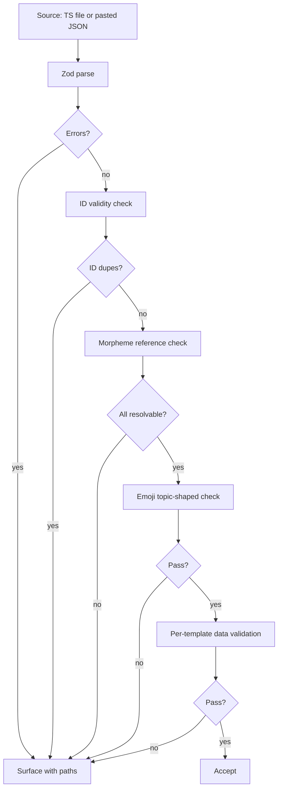

# Authoring

Three paths for getting content into evo-quest:

1. **TypeScript path** — strongest typing, most powerful. Drop a file in
   `src/content/<wing>/<room>.ts`, add one import line, content appears.
2. **AI-assisted path** — copy a prompt blurb, paste to any LLM, paste
   the result into `/content/import`. The blurb is *generated from the
   live Zod schema* so it's always in sync.
3. **Manual JSON path** — write a `ContentModule` JSON by hand against
   the schema docs at `/content/format`. Import via the same flow.

All three converge on the same Zod validation pipeline. Validation
errors are surfaced with paths and human-readable messages.

---

## 1. The TypeScript path (primary for bundled content)

### 1.1 Directory layout

```
src/content/
  evolution/
    index.ts                    # exports one ContentModule
    origin.ts                   # one Room as a const
    selection.ts                # one Room as a const
    evidence.ts
    speciation.ts
    deep-time.ts
  cells/
    index.ts
    theory.ts
    organelles.ts
    membrane.ts
    energy.ts
    cycle.ts
  genetics/
    index.ts
    mendel.ts
    exceptions.ts
    sex-linked.ts
    pedigrees.ts
    dna.ts
    protein.ts
    mutation.ts
    engineering.ts
  etymology/
    morphemes.ts                # global morpheme registry
  index.ts                      # registers all modules
```

### 1.2 Authoring a Room file

```ts
// src/content/evolution/origin.ts
import type { Room } from '@/types';
import { unit } from '../helpers';

export const origin: Room = {
  id: 'evo.origin',
  slug: 'origin-of-life',
  title: 'Origin of Life',
  emoji: '🌋',
  description: 'How biology bootstrapped from chemistry.',
  children: [
    {
      id: 'evo.origin.abiogenesis',
      slug: 'abiogenesis',
      title: 'Abiogenesis',
      children: [
        unit({
          id: 'evo.origin.abiogenesis.miller-urey',
          slug: 'miller-urey',
          title: 'The Miller-Urey Experiment',
          emoji: '⚗️',
          shortLabel: 'Miller-Urey',
          longLabel: 'The Miller-Urey Apparatus',
          teach: {
            headline: 'Lightning + Soup = Amino Acids',
            body: `In 1953, Stanley Miller and Harold Urey ran electrical sparks
                   through a sealed flask of methane, ammonia, hydrogen, and
                   water vapor — a guess at early Earth's atmosphere. Within
                   a week, the flask contained amino acids.`,
            etymology: {
              termId: 'term.abiogenesis',
              term: 'abiogenesis',
              morphemes: [
                { morphemeId: 'morph.a-', asUsed: 'a' },
                { morphemeId: 'morph.bio', asUsed: 'bio' },
                { morphemeId: 'morph.genesis', asUsed: 'genesis' },
              ],
              rootSummary: 'Greek: a- (without) + bios (life) + genesis (birth)',
            },
            mnemonic: 'A=WITHOUT, BIO=LIFE, GENESIS=BIRTH. The very first beginning — life from non-life.',
            poweredIdea: 'Life can begin from non-life when energy meets the right chemicals.',
          },
          quizzes: [
            {
              kind: 'speed-reveal-mnemonic',
              id: 'quiz.evo.origin.miller-urey.sr-1',
              data: {
                termId: 'term.abiogenesis',
                root: 'Greek: a- (without) + bios (life) + genesis (birth)',
                mnemonic: 'A=WITHOUT, BIO=LIFE, GENESIS=BIRTH. The very first beginning — life from non-life.',
                question: {
                  kind: 'fill',
                  prompt: 'Miller and Urey produced amino acids and _____ from early-atmosphere gases.',
                  acceptable: ['sugars', 'sugar'],
                  hint: 'Simple carbohydrate',
                },
              },
            },
            {
              kind: 'predict-run-reflect',
              id: 'quiz.evo.origin.miller-urey.prr-1',
              data: { /* ... */ },
            },
          ],
          achievement: {
            id: 'ach.evo.origin.miller-urey',
            emoji: '⚗️',
            shortLabel: 'Miller-Urey',
            longLabel: 'The Miller-Urey Apparatus',
            flavor: 'Lightning strikes the flask. Amino acids precipitate.',
            wingId: 'evo',
          },
          difficulty: 'core',
        }),
        // ... more units
      ],
    },
    // ... more drawers
  ],
};
```

### 1.3 The `unit()` helper

```ts
// src/content/helpers.ts
import { KnowledgeUnitSchema, type KnowledgeUnit } from '@/types';

export function unit(u: Omit<KnowledgeUnit, 'enabled'>): KnowledgeUnit {
  const validated = KnowledgeUnitSchema.parse({ ...u, enabled: true });
  return validated;
}
```

The helper Zod-validates at *runtime in dev* (or at *build time* if
running in a build context), surfacing errors immediately. In prod
builds, validation is stripped from the helper since the build-time
pass catches everything.

### 1.4 Registering a Wing

```ts
// src/content/evolution/index.ts
import type { ContentModule } from '@/types';
import { origin } from './origin';
import { selection } from './selection';
import { evidence } from './evidence';
import { speciation } from './speciation';
import { deepTime } from './deep-time';

const module: ContentModule = {
  id: 'mod.evolution.bundled',
  title: 'Evolution',
  description: 'Five Rooms covering the origin of life through the present.',
  authorRef: 'EvoQuest Team',
  schemaVersion: 1,
  appVersionAtAuthoring: '__APP_VERSION__',     // replaced at build time
  source: 'bundled',
  createdAt: 1716595200000,                    // build-time stamp
  tree: [{
    id: 'evo',
    slug: 'evolution',
    title: 'Evolution',
    emoji: '🧬',
    children: [origin, selection, evidence, speciation, deepTime],
  }],
};

export default module;
```

### 1.5 Registering at root

```ts
// src/content/index.ts
import evolution from './evolution';
import cells from './cells';
import genetics from './genetics';

export const CONTENT_MODULES: ContentModule[] = [evolution, cells, genetics];
```

Adding a Wing = create folder + one import line. The
content-management page picks it up automatically.

---

## 2. The AI-assisted path

### 2.1 Where it lives

`/content/format` is the format documentation page. It includes:

- A live-rendered Zod schema explorer (every type, every field, every
  constraint, with descriptions)
- One worked example per game type (from each game-type spec's
  `exemplar`)
- A **"Copy AI prompt for new content"** button at the top

### 2.2 The AI prompt blurb (full text)

The blurb is *generated from the live Zod schema*, so it stays in sync
when types change. Here's the canonical structure:

```text
You are an evo-quest content author. Output a single JSON value matching
the ContentModule schema below. The user wants content about: <TOPIC>.

# ContentModule

{
  id: string                 // "mod.<topic>.<author>" — kebab-case
  title: string              // human title, ≤80 chars
  description: string        // 1-2 sentences
  authorRef: string          // your handle (optional)
  schemaVersion: 1
  appVersionAtAuthoring: "<current app version>"
  source: "user-import"
  createdAt: <unix ms>
  tree: Wing[]               // see below
  etymologyContributions?: Morpheme[]   // morphemes not in core
}

# Wing
{
  id: string                 // top-level prefix, e.g. "ecology"
  slug: string
  title: string
  emoji?: string
  description?: string
  children: Room[]
}

# Room  (same shape as Wing, but children = Drawer[])
# Drawer (same shape, but children = KnowledgeUnit[])

# KnowledgeUnit
{
  id: string                 // dotted: "<wing>.<room>.<drawer>.<slug>" — IMMUTABLE
  slug: string
  title: string
  emoji: string              // topic-shaped, NOT a trophy/star/medal
  shortLabel: string         // ≤14 chars, 1-2 words
  longLabel: string          // ≤40 chars
  description?: string
  teach: TeachBlock
  quizzes: QuizTemplate[]    // ≥1
  achievement: Achievement
  prerequisites?: string[]
  difficulty?: "intro" | "core" | "deep"
  tags?: string[]
  enabled: true
}

# TeachBlock
{
  headline: string           // ≤60 chars
  body: string               // markdown, 1-3 short paragraphs
  etymology?: Etymology
  mnemonic?: string          // ≤140 chars, ALL-CAPS the morpheme→hook mapping
  poweredIdea: string        // ≤120 chars, ONE sentence
  cite?: string[]
}

# Etymology
{
  termId: string             // "term.<word>"
  term: string
  morphemes: [{ morphemeId: string, asUsed: string }, ...]
  rootSummary: string        // "Greek: a- (without) + bios (life) + genesis (birth)"
}

# Achievement
{
  id: string                 // "ach.<unit.id>"
  emoji: string              // topic-shaped — same emoji as the unit's
  shortLabel: string         // 1-2 words
  longLabel: string          // 2-6 words
  flavor: string             // ONE present-tense second-person sentence, ≤140 chars,
                             // narrating the IDEA not the student
  wingId: string             // matches the Wing's id
}

# QuizTemplate (discriminated union by 'kind')

Available kinds and their `data` shapes:

## kind: "speed-reveal-mnemonic"
data: {
  termId: string
  root: string
  mnemonic: string           // ≤140 chars
  question:
    | { kind: "multiple-choice", prompt: string, options: string[], correctIndex: number }
    | { kind: "fill", prompt: string, acceptable: string[], hint?: string }
  countdownMs?: number       // default 6000
  revealMs?: number          // default 5000
}

(...one block per kind, generated from each game-type's schema...)

# Rules

1. IDs are stable forever. Choose carefully. Use lowercase, dotted hierarchy.
2. Mnemonics MUST be vivid. ALL-CAPS the morpheme→hook mapping.
   Bad:  "Endosymbiosis is when one cell lives inside another"
   Good: "ENDO=INSIDE, SYM=TOGETHER. Roommates for 2 billion years."
3. Achievement flavors narrate the IDEA, not the student's correctness.
   Bad:  "Great job remembering the Krebs cycle!"
   Good: "Eight steps, around and around. CO₂ comes out."
4. Achievement emojis are topic-shaped. NEVER use 🏆 ⭐ 💯 🥇 🎖️ 🎯.
5. Every KnowledgeUnit has ≥1 quiz template. Two or three is better.
6. Etymology entries reference morphemeIds. Provide
   `etymologyContributions` for any morpheme not in the core registry.
7. Output a single complete JSON value, no markdown fences, no commentary.

The current app version is: <APP_VERSION>
The current schema version is: 1

Topic to author: <TOPIC>
```

### 2.3 The import flow

1. Student copies the prompt with one tap on `/content/format`
2. Pastes to their preferred LLM, replacing `<TOPIC>`
3. LLM returns JSON
4. Student pastes JSON into `/content/import` textarea
5. **Validate** button runs Zod
6. If validation passes, preview tree shows; **Add to library** commits
7. If validation fails, errors are listed with paths:

   ```
   ✗ tree[0].children[2].children[1].children[0].achievement.emoji
     Expected topic-shaped emoji. "🏆" matches the forbidden list.

   ✗ tree[0].children[2].children[1].children[0].teach.mnemonic
     Exceeds 140 characters (current: 168). Trim or split into two units.

   ✗ Unknown morphemeId "morph.proto" referenced in
     tree[0].children[2].children[1].children[0].teach.etymology.morphemes[0].
     Add a Morpheme entry to etymologyContributions for "proto" (Greek:
     "first").
   ```

8. Student fixes (likely by re-running with the AI), retries

### 2.4 Round-trip safety

The full pipeline:

```
LLM JSON → Zod parse → migrate-if-needed → validate against current schema
       → store in evo-quest.v1.modules.userModules
       → registered alongside bundled modules at runtime
```

Once stored, the module persists across app updates. Schema upgrades
apply automatically via the storage migration framework
([`storage.md`](./storage.md)).

---

## 3. The manual JSON path

Some authors prefer hand-writing JSON. The format docs at `/content/
format` are sufficient for this — they show every type, every field,
every constraint. The same import flow applies.

This path is essentially identical to the AI-assisted path; only the
source of the JSON differs.

---

## 4. The author handbook

### 4.1 Writing a good mnemonic

The mnemonic is the single most expensive piece of content per unit.
Allow 3-5 minutes per term. Conventions:

- **ALL-CAPS the morpheme→hook mapping.** Example: "ENDO=INSIDE".
- **Use a vivid image.** "Roommates for 2 billion years" beats "long
  coexistence."
- **Use a familiar reference.** "Like an endoscope, only forever."
- **End with a punchline.** A short, memorable closing phrase that the
  speed-reveal will land on.
- **≤140 chars.** Speed-reveal completes in 5 seconds; longer mnemonics
  feel rushed.

### 4.2 Writing a great achievement flavor

- **Second person, present tense.**
- **Narrate the idea, not the student.**
- **One sentence.**
- **≤140 chars.**
- **Use the topic's specific vocabulary.** "The flask cools" beats
  "Something happens."

### 4.3 Choosing the right game type

| If the unit teaches… | Prefer game type(s) |
|---|---|
| A new term with strong etymology | `speed-reveal-mnemonic` (always) + one other |
| A process with ordered steps | `recipe-sequencer` or `procedure-builder` |
| A geometric relationship (Punnett, pedigree, codon table) | `punnett-builder` / `pedigree-detective` / `mutation-lab` |
| A conceptual misconception | `debug-the-claim` |
| Cause-and-effect across systems | `food-web-builder` or `concept-map-builder` |
| Historical contingency | `counterfactual-lab` |
| A spatial concept (organelle layout) | `palace-walk` or `parts-labeler` |
| A first-person perspective (molecule's POV) | `be-the-turtle` |
| A model with parameters | `microworld-sandbox` |
| Phylogenetic relationships | `cladogram-crafter` |
| A prediction-able outcome | `predict-run-reflect` |

A unit ideally has *one fast-lane* template (for quick reviews) and
*one or two microworld* templates (for deep dives). The engine's
selection (engine.md §5) biases appropriately.

### 4.4 When to add etymology

Always, if the term has a clear Greek/Latin root. The etymology card
fires on every encounter — it costs nothing to include and pays off
big over the curriculum.

Skip etymology only if the term is genuinely native English with no
classical root (e.g., "wing", "leaf").

### 4.5 When to add a morpheme to the registry

If the morpheme will appear in ≥2 terms across the curriculum,
register it in `src/content/etymology/morphemes.ts`. Otherwise, declare
it inline via `etymologyContributions` in the module.

The morpheme registry's cross-context glow (§5 in app.md) only fires
for registry entries, not inline contributions. Registry membership =
"this morpheme is part of biology's structural vocabulary."

### 4.6 Difficulty tagging

- **`intro`**: a student new to biology can engage. Avoid jargon
  chains; one term per question.
- **`core`**: standard high school biology. Assumes basic vocabulary.
- **`deep`**: requires several prerequisites; only enables `mixed` or
  `microworld` selection.

The Settings page lets students cap difficulty. Default cap is `core`
until the student earns 50 unit unlocks, then `deep` unlocks
automatically.

---

## 5. Validation pipeline (in detail)



### 5.1 Build-time validation (TS path)

Build script `scripts/validate-content.ts` runs on every `bun build`:

- Imports all `ContentModule`s from `src/content/index.ts`
- Runs full pipeline
- Fails CI if any module is invalid

### 5.2 Runtime validation (import path)

Same pipeline, runs in the browser when the student clicks **Validate**.
Identical behavior; identical error messages.

### 5.3 The forbidden-emoji check

A list of emojis is banned from achievements: `🏆 ⭐ 💯 🥇 🎖️ 🎯 🎊 🎉
👏 🙌 💪 🔝 ⚡ (when used as 'energy bolt' generic) 💎 (when not
geological)`. The check is on the literal emoji string. Authors can
override the ban with a `_overrideForbiddenEmoji: true` field — used
sparingly, e.g. ⚡ legitimately fits the mitochondrion unit.

The override is reviewed by maintainers on bundled content PRs; on
user-imported content, it's allowed (we trust the user with their own
data).

---

## 6. Sharing user-authored content

V1 does not have a hosted gallery for sharing user-authored modules.
The path is manual:

- Export the module: `/content/modules → <user module> → Export`
- Share the resulting JSON file (email, chat, link)
- Recipient: `/content/import → Paste JSON → Add to library`

V2 may add a hosted gallery (curated, opt-in) on top of the same JSON
contract — the file format won't change.

---

## 7. Common author mistakes

| Mistake | Fix |
|---|---|
| Mnemonic is just a restated definition | Add a vivid IMAGE or familiar word that hooks the term |
| Achievement flavor says "you got it!" | Rewrite to narrate the *idea* in second person |
| Trophy emoji on a unit | Pick a topic-shaped emoji (organelle, fossil, plant part) |
| Two units share same `(emoji, shortLabel)` | Differentiate one with a more specific label |
| Mnemonic over 140 chars | Trim, or split unit into two |
| Quiz array has only one template kind across all units in a Drawer | Mix at least two kinds per Drawer; variety reinforces |
| Etymology missing for a Greek/Latin term | Add it. Always. |
| `prerequisites` chain that's a cycle | Cycles are detected at validation; restructure |
| Power-up themed reskin assumed on unit author side | Power-up theming is engine-side; authors don't control it |
| Mutable IDs ("draft-1") that change between commits | IDs are forever. Pick final IDs before first publish. |

---

## 8. Author tooling (post-v1)

Planned for v1.x:

- **Author scratchpad** at `/content/draft` that lets a user write
  units in-app with live preview
- **AI handoff button**: opens a sidebar with the prompt prefilled and
  routes to an embedded LLM call (the user provides their API key,
  stored in localStorage)
- **Diff view**: compare a new module against an existing one to catch
  ID renames and removals

These are post-v1 because the import flow already covers the use case;
the in-app authoring is a polish upgrade.
