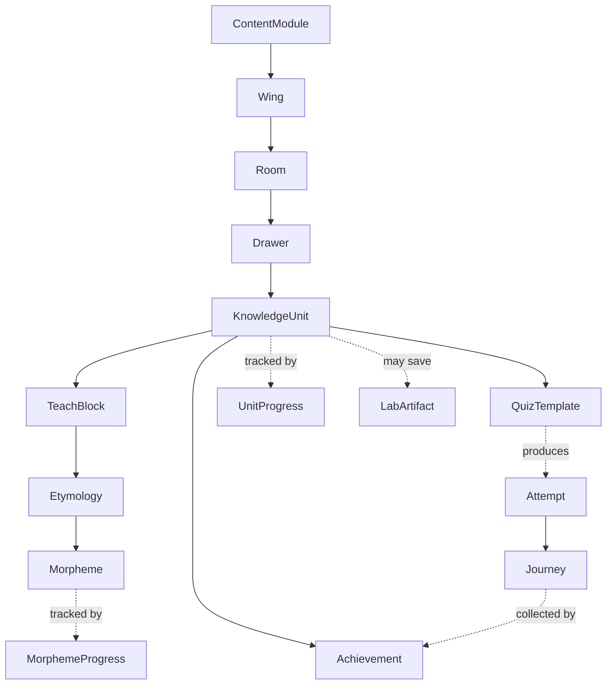

# Data Model

Single source of truth for every TypeScript type and Zod schema in
evo-quest. When app.md §3 or any game-type design doc says "see the data
model," they mean here.

Two rules govern this file:

1. **Every public type has an accompanying Zod schema.** Zod is the
   runtime validator; TS types are inferred via `z.infer<>` so they
   cannot drift.
2. **Every ID is forever.** Once a value flows into a real user's
   localStorage, that exact string must keep resolving forever (or via
   declared aliases). See [`storage.md`](./storage.md) for the
   enforcement mechanism.

---

## Type relationship overview



---

## 1. The content tree

### `Wing`, `Room`, `Drawer`

Same recursive shape; only the `children` field differs.

```ts
type TreeNode<Child> = {
  id: string;                      // immutable; dotted prefix (see §11)
  aliases?: string[];              // for renames; never removed
  slug: string;                    // url-safe display token
  title: string;
  emoji?: string;
  description?: string;
  children: Child[];
};

type Wing = TreeNode<Room>;
type Room = TreeNode<Drawer>;
type Drawer = TreeNode<KnowledgeUnit>;
```

Zod:

```ts
const TreeNodeSchema = <C extends z.ZodTypeAny>(child: C) =>
  z.object({
    id: z.string().regex(/^[a-z0-9.-]+$/),
    aliases: z.array(z.string()).optional(),
    slug: z.string().regex(/^[a-z0-9-]+$/),
    title: z.string().min(1).max(80),
    emoji: z.string().optional(),
    description: z.string().max(280).optional(),
    children: z.array(child),
  });

const KnowledgeUnitSchema = z.lazy(() => ...);   // forward ref
const DrawerSchema = TreeNodeSchema(KnowledgeUnitSchema);
const RoomSchema = TreeNodeSchema(DrawerSchema);
const WingSchema = TreeNodeSchema(RoomSchema);
```

---

## 2. KnowledgeUnit

The atomic teaching cell.

```ts
type KnowledgeUnit = {
  id: string;                      // "evo.origin.abiogenesis.miller-urey"
  aliases?: string[];
  slug: string;
  title: string;
  emoji: string;
  shortLabel: string;              // ≤14 chars; for home grid
  longLabel: string;               // ≤40 chars; for journeys page
  description?: string;

  teach: TeachBlock;
  quizzes: QuizTemplate[];         // ≥1
  achievement: Achievement;

  prerequisites?: string[];        // KnowledgeUnit ids; soft suggestion
  difficulty?: 'intro' | 'core' | 'deep';
  tags?: string[];                 // free-form for cross-cutting filters

  enabled: boolean;
  authorNotes?: string;            // never shown to students
};

type TeachBlock = {
  headline: string;                // ≤60 chars
  body: string;                    // markdown; ~1-3 paragraphs
  etymology?: Etymology;
  mnemonic?: string;               // ≤140 chars; for speed-reveal
  poweredIdea: string;             // ≤120 chars; one-sentence "big idea"
  imageUrl?: string;
  cite?: string[];
};

type Achievement = {
  id: string;                      // "ach.evo.origin.miller-urey"
  emoji: string;
  shortLabel: string;              // 1-2 words
  longLabel: string;
  flavor: string;                  // 2nd-person present-tense; ≤140 chars
  wingId: string;                  // for palette + grouping
  hidden?: boolean;                // off the home grid until earned
  aggregate?: AggregateAchievementRef;  // see §5
};
```

Zod:

```ts
const KnowledgeUnitSchema = z.object({
  id: z.string().regex(/^[a-z0-9-]+(\.[a-z0-9-]+)+$/),
  aliases: z.array(z.string()).optional(),
  slug: z.string().regex(/^[a-z0-9-]+$/),
  title: z.string().min(1).max(80),
  emoji: z.string().min(1).max(8),
  shortLabel: z.string().min(1).max(14),
  longLabel: z.string().min(1).max(40),
  description: z.string().max(280).optional(),
  teach: TeachBlockSchema,
  quizzes: z.array(QuizTemplateSchema).min(1),
  achievement: AchievementSchema,
  prerequisites: z.array(z.string()).optional(),
  difficulty: z.enum(['intro', 'core', 'deep']).optional(),
  tags: z.array(z.string()).optional(),
  enabled: z.boolean().default(true),
  authorNotes: z.string().optional(),
});
```

---

## 3. Quiz templates

Discriminated union, one variant per game type. See
[`engine.md`](./engine.md) for how the registry assembles these.

```ts
type QuizTemplate =
  | { kind: 'speed-reveal-mnemonic';   id: string; preferred?: boolean; data: SpeedRevealData }
  | { kind: 'be-the-turtle';           id: string; preferred?: boolean; data: BeTheTurtleData }
  | { kind: 'microworld-sandbox';      id: string; preferred?: boolean; data: MicroworldSandboxData }
  | { kind: 'predict-run-reflect';     id: string; preferred?: boolean; data: PredictRunReflectData }
  | { kind: 'procedure-builder';       id: string; preferred?: boolean; data: ProcedureBuilderData }
  | { kind: 'recipe-sequencer';        id: string; preferred?: boolean; data: RecipeSequencerData }
  | { kind: 'palace-walk';             id: string; preferred?: boolean; data: PalaceWalkData }
  | { kind: 'punnett-builder';         id: string; preferred?: boolean; data: PunnettBuilderData }
  | { kind: 'pedigree-detective';      id: string; preferred?: boolean; data: PedigreeDetectiveData }
  | { kind: 'etymology-puppet';        id: string; preferred?: boolean; data: EtymologyPuppetData }
  | { kind: 'mutation-lab';            id: string; preferred?: boolean; data: MutationLabData }
  | { kind: 'concept-map-builder';     id: string; preferred?: boolean; data: ConceptMapBuilderData }
  | { kind: 'food-web-builder';        id: string; preferred?: boolean; data: FoodWebBuilderData }
  | { kind: 'debug-the-claim';         id: string; preferred?: boolean; data: DebugTheClaimData }
  | { kind: 'counterfactual-lab';      id: string; preferred?: boolean; data: CounterfactualLabData }
  | { kind: 'cladogram-crafter';       id: string; preferred?: boolean; data: CladogramCrafterData }
  // self-debug-confidence wraps any template; see engine.md
;
```

Each `<Kind>Data` shape is authoritatively defined in its game-type
design doc (e.g.,
[`../game-types/01-speed-reveal-mnemonic.md`](../game-types/01-speed-reveal-mnemonic.md)).
The Zod schemas live in `src/engine/templates/<kind>.ts` and are
collected at build time into `QuizTemplateSchema`.

Discriminated-union Zod pattern:

```ts
const QuizTemplateSchema = z.discriminatedUnion('kind', [
  z.object({ kind: z.literal('speed-reveal-mnemonic'), id: z.string(),
             preferred: z.boolean().optional(),
             data: SpeedRevealDataSchema }),
  // ... one per kind ...
]);
```

---

## 4. Etymology & morphemes

```ts
type Etymology = {
  termId: string;                  // "term.endosymbiosis"
  term: string;                    // display form
  morphemes: MorphemeRef[];        // ordered, as in the term
  rootSummary: string;             // "Greek: endo + sym + bios"
};

type MorphemeRef = {
  morphemeId: string;              // "morph.endo"
  asUsed: string;                  // surface form, e.g. "endo"
};

type Morpheme = {
  id: string;                      // "morph.endo"
  morpheme: string;                // canonical form, e.g. "endo"
  language: 'Greek' | 'Latin' | 'Old English' | 'Other';
  meaning: string;                 // ≤30 chars
  cousins?: string[];              // morpheme ids with related meaning
  appearsIn: string[];             // KnowledgeUnit ids (computed)
};
```

Morphemes are registered globally; etymologies reference them by id. See
[`authoring.md`](./authoring.md) for the build-time validation that
catches unknown morpheme ids.

---

## 5. Achievement aggregation

Aggregates roll up — a Drawer aggregate unlocks when all its units do.

```ts
type AggregateAchievementRef = {
  scope: 'drawer' | 'room' | 'wing';
  nodeId: string;                  // the Drawer/Room/Wing id
  emoji: string;
  shortLabel: string;
  flavor: string;
};
```

A unit-level achievement carries an optional `aggregate` pointing to its
parent's group achievement so the engine can detect rollup completion.

---

## 6. ContentModule

The unit of distribution (bundled OR user-imported).

```ts
type ContentModule = {
  id: string;                      // "evolution.bundled" | "cells.user.alice"
  title: string;
  description: string;
  authorRef?: string;
  schemaVersion: number;           // increments on breaking shape changes
  appVersionAtAuthoring: string;
  tree: Wing[];                    // the content this module contributes
  etymologyContributions?: Morpheme[];
  source: 'bundled' | 'user-import';
  createdAt: number;
};
```

Validation rules:

- Every `KnowledgeUnit.id` starts with one of the module's wing ids
- Every `Morpheme.id` referenced is either in core or in
  `etymologyContributions`
- Every `Wing.id` is unique across all loaded modules (collisions force
  rename via `aliases`)

---

## 7. User state — per-unit progress

```ts
type UnitProgress = {
  unitId: string;
  firstSeenAt: number;
  attempts: number;
  correct: number;
  lastSeenAt: number;
  lastFiveOutcomes: Array<{ correct: boolean; ms: number; templateKind: string }>;
  templatesEncountered: string[];  // distinct kinds
  tier: 'locked' | 'unlocked' | 'bronze' | 'silver' | 'gold';
  unlockedAt?: number;
  achievementEarned: boolean;
};
```

Storage: keyed map at `evo-quest.v1.units` → `Record<string, UnitProgress>`.
Tier computation rules in [`achievements.md`](./achievements.md).

---

## 8. User state — per-morpheme progress

```ts
type MorphemeProgress = {
  morphemeId: string;
  firstSeenAt: number;
  encounters: number;
  correctEncounters: number;
  lastSeenAt: number;
  termsAssembled: string[];        // for etymology-puppet
};
```

Storage: `evo-quest.v1.morphemes`.

---

## 9. Journey & Attempt

```ts
type Journey = {
  id: string;                      // ulid
  startedAt: number;
  endedAt?: number;
  abandoned?: boolean;
  selection: SelectionDescriptor;
  attempts: Attempt[];
  achievementsEarned: string[];
  artifactsSaved: string[];
  morphemesTouchedFirst: string[];
  finalScore: { correct: number; total: number; bestStreak: number };
  elapsedSec: number;
};

type Attempt = {
  attemptId: string;
  unitId: string;
  templateKind: string;
  templateId?: string;             // for units with multiple templates of same kind
  correct: boolean;
  ms: number;
  confidence?: number;             // 0..1, if calibration was on
  details?: Record<string, unknown>;   // template-specific structured data
};

type SelectionDescriptor =
  | { kind: 'quick-mix'; length: number }
  | { kind: 'deep-dive'; nodeId: string; length: number }
  | { kind: 'trouble'; length: number }
  | { kind: 'wrong-only'; sinceJourneyId?: string }
  | { kind: 'mixed-trouble'; troubleUnitId: string; relatedCount: number }
  | { kind: 'branch'; nodeId: string }
  | { kind: 'journey-replay'; sourceJourneyId: string };
```

Storage:

- In-progress journey → `evo-quest.v1.session`
- Completed journeys → `evo-quest.v1.journeys[]` (capped, see
  [`storage.md`](./storage.md))

---

## 10. Lab Notebook & Settings

```ts
type LabArtifact = {
  id: string;                      // ulid
  kind: string;                    // template kind that produced it
  unitId: string;
  journeyId: string;
  createdAt: number;
  title: string;                   // human-readable
  snapshot: unknown;               // template-specific serializable state
  thumbnail?: string;              // base64 svg
};

type PowerUpInventory = {
  slots: Array<PowerUpInstance | null>;   // length 3
  earned: number;                  // total ever earned (telemetry-like)
  spent: number;
};

type PowerUpInstance = {
  id: string;                      // power-up catalog id
  acquiredAt: number;
  themedFor?: string;              // wing id for visual skin
};

type Settings = {
  appearance: {
    // The app is dark-mode only by design — no theme field.
    contrast: 'normal' | 'high';
    fontSize: 'sm' | 'md' | 'lg';
    dyslexiaFont: boolean;
    colorBlindSafe: boolean;
  };
  motion: 'full' | 'reduced' | 'off';
  audio: {
    enabled: boolean;
    volume: number;                // 0..1
    stings: Partial<Record<string /* StingId */, boolean>>;
  };
  reveals: {
    countdownMs: number;
    revealMs: number;
  };
  practice: {
    confidenceFrequency: 'every' | 'every-3' | 'never';
    defaultMood: 'fast-lane' | 'mixed' | 'microworld';
    defaultLength: 5 | 10 | 15 | 20;
  };
  privacy: {
    anonymousCrashReports: boolean;
  };
};
```

---

## 11. ID conventions

Every ID belongs to a namespace prefix that makes its kind apparent:

| Prefix | Meaning | Example |
|---|---|---|
| (none, dotted) | content node | `evo.origin.abiogenesis.miller-urey` |
| `ach.` | achievement | `ach.evo.origin.miller-urey` |
| `term.` | etymology term | `term.endosymbiosis` |
| `morph.` | morpheme | `morph.endo` |
| `quiz.` | quiz template instance | `quiz.evo.origin.miller-urey.fill-1` |
| `pu.` | power-up catalog item | `pu.darwin-notebook` |
| `mod.` | content module | `mod.evolution.bundled` |
| ulid | runtime instances | journeys, attempts, artifacts |

Rules:

- Lowercase, kebab-within-segments, dot-separated for hierarchy
- ASCII letters, digits, `.`, `-` only
- **Immutable once shipped.** If a human-facing rename is needed, add
  the old ID to `aliases: string[]` and route resolution to walk
  aliases.
- **No reuse.** A retired ID cannot be repurposed for new content.

---

## 12. Versioning & migration markers

Every stored blob is wrapped:

```ts
type StoredBlob<T> = {
  schemaVersion: number;
  savedAt: number;
  appVersion: string;
  payload: T;
};
```

Migration framework lives in [`storage.md`](./storage.md). Type-level
contract: each storage key has a `LATEST_SCHEMA_VERSION` constant and a
migrations array of `(prevPayload) => nextPayload`.

---

## 13. Putting it together

A "fully populated" content module Zod-validates against
`ContentModuleSchema`, which transitively validates every nested
type. A "fully populated" user state Zod-validates against the
union of all `evo-quest.v1.*` blob schemas.

When in doubt about whether a field belongs on the type, check the
single-test rule:

> *Does this field need to be the same across runs?*
> If yes, it lives on `KnowledgeUnit` (content, immutable).
> *Does this field record user actions or state?*
> If yes, it lives on `UnitProgress` / `Journey` / `Attempt` / etc.
> (state, per-user).

Never mix the two on the same object.
