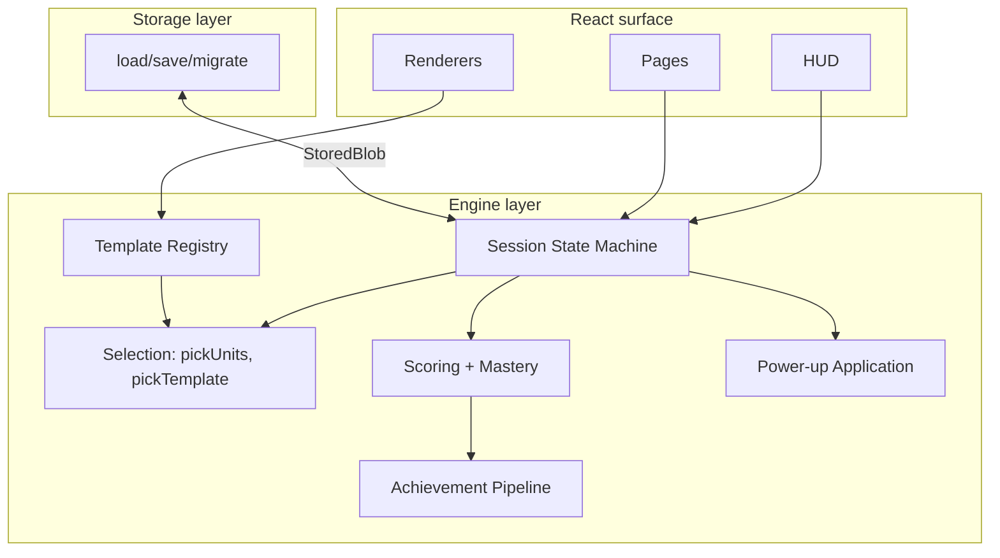
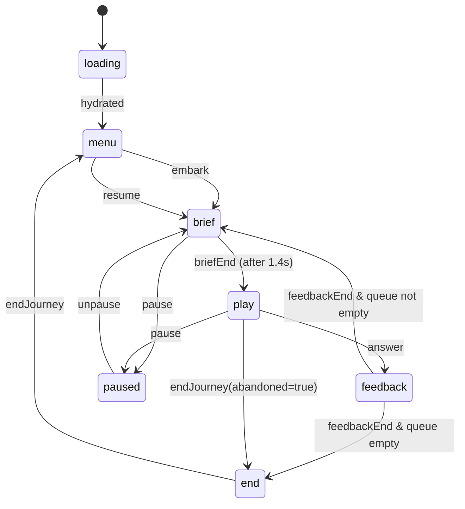

# Engine

The engine is the **storage-agnostic logic** of evo-quest: the play loop
state machine, the template registry, selection algorithms, scoring,
mastery computation, achievement unlocking, and power-up application.

It deliberately knows nothing about React rendering or localStorage
shape; it produces pure values from pure inputs. Side effects
(persistence, navigation) happen at the boundary.

This separation makes the engine trivially testable and lets the
**resume invariant** in [`storage.md`](./storage.md) hold without
engine-level cooperation.

---

## 1. Layer diagram



The engine is the middle band. The arrows above are calls/data flow, not
React state subscriptions.

---

## 2. Template registry

A registry is a map of `kind` → `TemplateRegistration`. Each quiz
template (one per game-type file in `plan/game-types/`) registers itself
via a single export.

### 2.1 Registration shape

```ts
type TemplateRegistration<TData = unknown, TResultDetails = unknown> = {
  kind: string;                                    // matches filename stem
  schema: z.ZodSchema<TData>;                      // Zod for `data` field
  exemplar: TData;                                 // for format docs page
  classifications: {
    fastLane: boolean;                             // ≤60s use cases
    microworld: boolean;                           // ≥3min deep dives
    constructionist: boolean;                      // produces a lab artifact?
    bodySyntonic: boolean;                         // role-play style?
    debugStyle: boolean;                           // debugging-as-game?
  };
  Renderer: ComponentType<RendererProps<TData, TResultDetails>>;
  Briefing?: ComponentType<{ data: TData }>;       // pre-question card; defaults to generic
  describePrompt: (data: TData) => string;         // for SR announcements
  estimateMs?: (data: TData) => number;            // session length estimation
  produceArtifact?: (data: TData, result: TResultDetails) => LabArtifact | null;
  defaultConfidenceMs?: number;                    // for prediction wrappers
};

type RendererProps<TData, TResultDetails> = {
  data: TData;
  onResult: (result: { correct: boolean; ms: number; details?: TResultDetails }) => void;
  onMicroEvent?: (event: MicroEvent) => void;     // for analytics-like telemetry (local)
  resumeFromSnapshot?: unknown;                    // mid-question resume
  saveSnapshot?: (snapshot: unknown) => void;     // debounced via writer
};
```

### 2.2 Auto-discovery

```ts
// src/engine/templates/index.ts
const modules = import.meta.glob('./[a-z]*.tsx', { eager: true });
export const REGISTRY: Record<string, TemplateRegistration> = {};

for (const path of Object.keys(modules)) {
  const reg = (modules[path] as { default: TemplateRegistration }).default;
  if (REGISTRY[reg.kind]) {
    throw new Error(`Duplicate template kind: ${reg.kind}`);
  }
  REGISTRY[reg.kind] = reg;
}
```

Adding a game type is one file. The registry assembles itself at
build time and is statically checkable.

### 2.3 Registry-level validation

At app boot, a self-check runs:

- Every `kind` matches `^[a-z][a-z0-9-]*$`
- Every `schema` is a valid Zod schema
- Every `Renderer` is a React component
- The set of known `kind`s is exposed as a const for tooling

A snapshot test in `src/engine/__tests__/registry.test.ts` pins the
known kinds so that an accidental rename trips CI.

---

## 3. Session state machine

The play loop is a discriminated union + reducer. No state framework.

### 3.1 States

```ts
type SessionState =
  | { phase: 'loading' }
  | { phase: 'menu' }
  | { phase: 'brief'; session: ActiveSession }
  | { phase: 'play';  session: ActiveSession }
  | { phase: 'feedback'; session: ActiveSession; feedback: Feedback }
  | { phase: 'paused';   session: ActiveSession }
  | { phase: 'end';      summary: SessionSummary };

type ActiveSession = {
  journeyId: string;                 // ulid
  queue: ScheduledItem[];            // ordered units + chosen template ids
  currentIndex: number;
  attempts: Attempt[];
  startedAt: number;
  bestStreak: number;
  currentStreak: number;
  selection: SelectionDescriptor;
  powerupUsage: Record<string, number>;
  artifactIds: string[];
  inFlightSnapshot?: unknown;        // template-level mid-question state
};

type ScheduledItem = {
  unitId: string;
  templateKind: string;
  templateId: string;                // pick of one of the unit's quizzes
};
```

### 3.2 Actions

```ts
type SessionAction =
  | { kind: 'embark'; selection: SelectionDescriptor; queue: ScheduledItem[] }
  | { kind: 'resume'; saved: ActiveSession }
  | { kind: 'briefEnd' }
  | { kind: 'answer'; correct: boolean; ms: number; details?: unknown }
  | { kind: 'feedbackEnd' }
  | { kind: 'pause' }
  | { kind: 'unpause' }
  | { kind: 'usePowerUp'; powerUpId: string; effects: PowerUpEffect[] }
  | { kind: 'midQuestionSnapshot'; snapshot: unknown }
  | { kind: 'endJourney'; abandoned?: boolean };
```

### 3.3 Transitions



### 3.4 Reducer

```ts
function reduce(state: SessionState, action: SessionAction): SessionState {
  switch (state.phase) {
    case 'menu':
      if (action.kind === 'embark') {
        return { phase: 'brief',
          session: { journeyId: ulid(), queue: action.queue, currentIndex: 0,
                     attempts: [], startedAt: Date.now(),
                     bestStreak: 0, currentStreak: 0,
                     selection: action.selection, powerupUsage: {}, artifactIds: [] } };
      }
      if (action.kind === 'resume') {
        return { phase: 'brief', session: action.saved };
      }
      return state;

    case 'brief':
      if (action.kind === 'briefEnd') return { phase: 'play', session: state.session };
      if (action.kind === 'pause')    return { phase: 'paused', session: state.session };
      return state;

    case 'play':
      if (action.kind === 'midQuestionSnapshot') {
        return { phase: 'play',
          session: { ...state.session, inFlightSnapshot: action.snapshot } };
      }
      if (action.kind === 'answer') {
        const item = state.session.queue[state.session.currentIndex];
        const attempt: Attempt = {
          attemptId: ulid(),
          unitId: item.unitId,
          templateKind: item.templateKind,
          templateId: item.templateId,
          correct: action.correct,
          ms: action.ms,
          details: action.details as Record<string, unknown> | undefined,
        };
        const newStreak = action.correct ? state.session.currentStreak + 1 : 0;
        return {
          phase: 'feedback',
          session: {
            ...state.session,
            attempts: [...state.session.attempts, attempt],
            currentStreak: newStreak,
            bestStreak: Math.max(state.session.bestStreak, newStreak),
            inFlightSnapshot: undefined,
          },
          feedback: computeFeedback(item, attempt),
        };
      }
      return state;

    case 'feedback':
      if (action.kind === 'feedbackEnd') {
        const next = state.session.currentIndex + 1;
        if (next >= state.session.queue.length) {
          return { phase: 'end', summary: summarize(state.session) };
        }
        return { phase: 'brief',
          session: { ...state.session, currentIndex: next } };
      }
      return state;

    // ...
  }
}
```

The reducer is pure. The React surface dispatches actions; storage
subscribes to the resulting state and persists.

### 3.5 Mid-question snapshots

Some templates (procedure-builder, concept-map-builder, etc.) have
non-trivial internal state mid-question. They call `saveSnapshot()` on
state changes:

- The Renderer's prop `saveSnapshot` is a stable function bound to the
  current `ScheduledItem`
- Snapshots flow through the reducer as `midQuestionSnapshot` actions
- The storage layer persists the entire `ActiveSession` after a 300ms
  debounce
- On reload (`resume`), the Renderer's `resumeFromSnapshot` prop carries
  the last snapshot back; the Renderer is responsible for restoring its
  local UI to that state

This is how a student can be mid-Punnett, refresh the page, and find
exactly the cells they had filled in.

---

## 4. Selection algorithms

The Embark panel (app.md §7.2) calls `buildQueue(selection, world,
state)` which returns a `ScheduledItem[]`.

### 4.1 Per-mode strategies

```ts
function buildQueue(
  selection: SelectionDescriptor,
  world: World,
  state: UserState
): ScheduledItem[] {
  switch (selection.kind) {
    case 'quick-mix':       return quickMix(world, state, selection.length);
    case 'deep-dive':       return deepDive(world, state, selection.nodeId, selection.length);
    case 'trouble':         return troubleTour(world, state, selection.length);
    case 'wrong-only':      return wrongOnly(world, state, selection.sinceJourneyId);
    case 'mixed-trouble':   return mixedTrouble(world, state, selection.troubleUnitId, selection.relatedCount);
    case 'branch':          return branchSweep(world, state, selection.nodeId);
    case 'journey-replay':  return replayJourney(world, state, selection.sourceJourneyId);
  }
}
```

### 4.2 Quick mix

```ts
function quickMix(world: World, state: UserState, length: number): ScheduledItem[] {
  const enabledUnits = collectEnabledUnits(world, state);
  // bias toward units the student has seen less recently
  const scored = enabledUnits.map(u => ({
    unit: u,
    score: 1 / (1 + daysSince(state.units[u.id]?.lastSeenAt ?? 0)),
  }));
  const picks = weightedSample(scored, length);
  return picks.map(p => ({
    unitId: p.unit.id,
    ...pickFastLaneTemplate(p.unit, state),
  }));
}
```

The `weightedSample` is sampling-without-replacement: a unit appears at
most once per queue.

### 4.3 Trouble tour

A unit is "trouble" if its `lastFiveOutcomes` has accuracy < 60% OR if
its only attempts are wrong.

```ts
function troubleTour(world: World, state: UserState, length: number): ScheduledItem[] {
  const trouble = collectEnabledUnits(world, state)
    .map(u => ({ unit: u, prog: state.units[u.id] }))
    .filter(({ prog }) => prog && isTrouble(prog));
  const picks = sampleN(trouble, length);
  return picks.map(({ unit }) => ({
    unitId: unit.id,
    ...pickAdaptiveTemplate(unit, state),    // bias to unseen kinds for this unit
  }));
}

function isTrouble(prog: UnitProgress): boolean {
  if (!prog.lastFiveOutcomes.length) return false;
  const accuracy = prog.lastFiveOutcomes.filter(o => o.correct).length / prog.lastFiveOutcomes.length;
  return accuracy < 0.6;
}
```

### 4.4 Mixed-trouble (the favorite per the spec)

One trouble unit, plus ~3 related units (same Drawer/Room). This gives
the student conceptual scaffolding around their weak spot.

```ts
function mixedTrouble(world: World, state: UserState, troubleUnitId: string, relatedCount: number) {
  const queue: ScheduledItem[] = [];
  const trouble = findUnit(world, troubleUnitId);
  if (!trouble) return [];

  // Find Drawer parent
  const drawer = findDrawerContaining(world, troubleUnitId);
  const siblings = drawer?.children.filter(u => u.id !== troubleUnitId) ?? [];
  const related = sampleN(siblings, relatedCount);

  // Interleave: related, related, trouble, related, related, trouble, ...
  // so the student gets context before the hard part
  for (let i = 0; i < related.length; i++) {
    queue.push(toScheduledItem(related[i], state, 'mixed'));
    if (i === Math.floor(related.length / 2)) {
      queue.push(toScheduledItem(trouble, state, 'adaptive'));
    }
  }
  return queue;
}
```

### 4.5 Wrong-only recovery

Picks every unit the student got wrong in the most recent completed
journey (or a specified journey id).

### 4.6 Branch sweep

Every enabled unit under a Wing/Room/Drawer node, in canonical (author)
order.

### 4.7 Journey replay

Re-runs the exact `ScheduledItem[]` of a previous journey, with
template choices re-rolled (the `templateKind` stays the same, but the
specific `templateId` within the unit may shuffle).

---

## 5. Template picking inside a queued unit

`pickTemplate(unit, state, mode)`:

```ts
type PickMode = 'fast-lane' | 'mixed' | 'microworld' | 'adaptive' | 'force';

function pickTemplate(unit: KnowledgeUnit, state: UserState, mode: PickMode, force?: string) {
  const seen = state.units[unit.id]?.templatesEncountered ?? [];
  const candidates = unit.quizzes.filter(q => {
    const reg = REGISTRY[q.kind];
    if (mode === 'fast-lane') return reg.classifications.fastLane;
    if (mode === 'microworld') return reg.classifications.microworld;
    if (mode === 'force') return q.kind === force;
    return true;
  });
  if (!candidates.length) return unit.quizzes[0];   // safety fallback

  if (mode === 'adaptive') {
    const unseen = candidates.filter(q => !seen.includes(q.kind));
    if (unseen.length) return pickPreferredOrRandom(unseen);
  }

  return pickPreferredOrRandom(candidates);
}

function pickPreferredOrRandom(qs: QuizTemplate[]) {
  const preferred = qs.filter(q => q.preferred);
  return preferred.length ? randomOf(preferred) : randomOf(qs);
}
```

---

## 6. Scoring + mastery

After every `Attempt`, the engine recomputes `UnitProgress` for the
affected unit.

```ts
function updateUnitProgress(prev: UnitProgress | undefined, attempt: Attempt): UnitProgress {
  const base: UnitProgress = prev ?? {
    unitId: attempt.unitId,
    firstSeenAt: Date.now(),
    attempts: 0,
    correct: 0,
    lastSeenAt: 0,
    lastFiveOutcomes: [],
    templatesEncountered: [],
    tier: 'locked',
    achievementEarned: false,
  };

  const next: UnitProgress = {
    ...base,
    attempts: base.attempts + 1,
    correct: base.correct + (attempt.correct ? 1 : 0),
    lastSeenAt: Date.now(),
    lastFiveOutcomes: [
      ...base.lastFiveOutcomes,
      { correct: attempt.correct, ms: attempt.ms, templateKind: attempt.templateKind },
    ].slice(-5),
    templatesEncountered: base.templatesEncountered.includes(attempt.templateKind)
      ? base.templatesEncountered
      : [...base.templatesEncountered, attempt.templateKind],
  };
  return { ...next, tier: computeTier(next) };
}

function computeTier(p: UnitProgress): UnitProgress['tier'] {
  if (p.correct === 0) return 'locked';
  if (p.correct === 1 && p.templatesEncountered.length >= 1) {
    // First unlock: this triggers achievement earning if !achievementEarned
    return 'unlocked';
  }
  const correctInLastThree = p.lastFiveOutcomes.slice(-3).filter(o => o.correct).length;
  if (p.correct >= 7 && p.templatesEncountered.length >= 4 && correctInLastThree === 3) return 'gold';
  if (p.correct >= 5 && p.templatesEncountered.length >= 3 && correctInLastThree === 3) return 'silver';
  if (p.correct >= 3 && p.templatesEncountered.length >= 2) return 'bronze';
  return 'unlocked';
}
```

Tier rules surface in [`achievements.md`](./achievements.md).

---

## 7. Achievement pipeline

```ts
function processAchievements(
  prev: UnitProgress | undefined,
  next: UnitProgress,
  unit: KnowledgeUnit,
  state: UserState
): AchievementEarned[] {
  const earned: AchievementEarned[] = [];

  // 1. Unit-level first-unlock
  if (next.tier !== 'locked' && !next.achievementEarned) {
    next.achievementEarned = true;
    earned.push({ achievementId: unit.achievement.id, kind: 'unit', earnedAt: Date.now() });
  }

  // 2. Mastery tier transitions
  if (prev?.tier !== next.tier && next.tier !== 'locked' && next.tier !== 'unlocked') {
    earned.push({ achievementId: `${unit.achievement.id}.${next.tier}`, kind: 'tier', earnedAt: Date.now() });
  }

  // 3. Aggregate rollups (Drawer/Room/Wing completion)
  const aggregateUnlocked = checkAggregateRollups(unit, state);
  earned.push(...aggregateUnlocked);

  // 4. Hidden achievements (cross-cutting conditions)
  earned.push(...checkHiddenAchievements(state));

  return earned;
}
```

Each `AchievementEarned` triggers:

- A celebratory animation (the tile dilates + glows)
- An audio sting (`unlock`)
- An entry in `Journey.achievementsEarned[]`

---

## 8. Power-up application

Power-up effects are descriptors, not direct mutations. The state machine
applies them.

```ts
type PowerUpEffect =
  | { kind: 'reveal-option'; index: number }
  | { kind: 'skip-no-penalty' }
  | { kind: 'add-time'; ms: number }
  | { kind: 'allow-retry' }
  | { kind: 'reveal-mnemonic-now' }
  | { kind: 'streak-shield' }
  | { kind: 'reroll-question' }
  | { kind: 'show-etymology-all' }
  | { kind: 'palace-teleport'; toTileId: string };

function applyPowerUp(state: SessionState, powerUpId: string): { state: SessionState; effects: PowerUpEffect[] } {
  const def = POWERUP_CATALOG[powerUpId];
  const effects = def.effects;
  // Update inventory + log usage
  // Effects flow back to the active Renderer via context
  // ...
}
```

The Renderer receives effects as a prop and applies them
template-specifically (e.g., `reveal-option` highlights one wrong
answer in a `match` template; in `fill` it might pre-fill one letter).

Full catalog in [`power-ups.md`](./power-ups.md).

---

## 9. Resume reconstruction

On app boot, if `evo-quest.v1.session` is present and validates:

```ts
function reconstructSession(saved: StoredBlob<ActiveSession>): SessionState {
  // Restore active session, position cursor at currentIndex, phase = brief
  // (so the student gets a fresh briefing rather than dropping into mid-question)
  // UNLESS inFlightSnapshot exists → phase = play with snapshot threaded
  return saved.payload.inFlightSnapshot
    ? { phase: 'play', session: saved.payload }
    : { phase: 'brief', session: saved.payload };
}
```

The Renderer's `resumeFromSnapshot` is the threading mechanism — the
engine doesn't peek inside template-specific snapshot bytes; it just
hands them back.

---

## 10. Confidence wrapper (self-debug-confidence)

The 17th game type is special — it doesn't replace the Renderer, it
wraps any other template:

```ts
function wrapWithCalibration(item: ScheduledItem, state: UserState): ScheduledItem & { calibration?: true } {
  const settings = state.settings;
  if (settings.practice.confidenceFrequency === 'never') return item;
  if (settings.practice.confidenceFrequency === 'every') return { ...item, calibration: true };
  // 'every-3': sample 1 in 3
  return { ...item, calibration: ((hash(item.unitId) ^ state.sessionCounter) % 3 === 0) };
}
```

When `calibration` is on, the session machine inserts a brief
"predict your confidence" step between brief and play. The result is
recorded in the calibration log (`evo-quest.v1.calibration`).

---

## 11. The engine's invariants

These hold by construction:

1. **Pure reduce**: `reduce(state, action)` is referentially transparent.
2. **No storage knowledge**: the engine never imports from
   `src/storage/`. Storage subscribes to the engine.
3. **No React knowledge**: the engine never imports React. Even types
   like `RendererProps` use `unknown` for component refs at the
   engine boundary.
4. **Deterministic queue building**: `buildQueue(selection, world,
   state)` with a fixed RNG seed produces identical queues — needed for
   `journey-replay` to actually replay reproducibly when desired (we
   pass a seed in the SelectionDescriptor for replay).

These invariants are pinned by tests in
`src/engine/__tests__/invariants.test.ts`.
