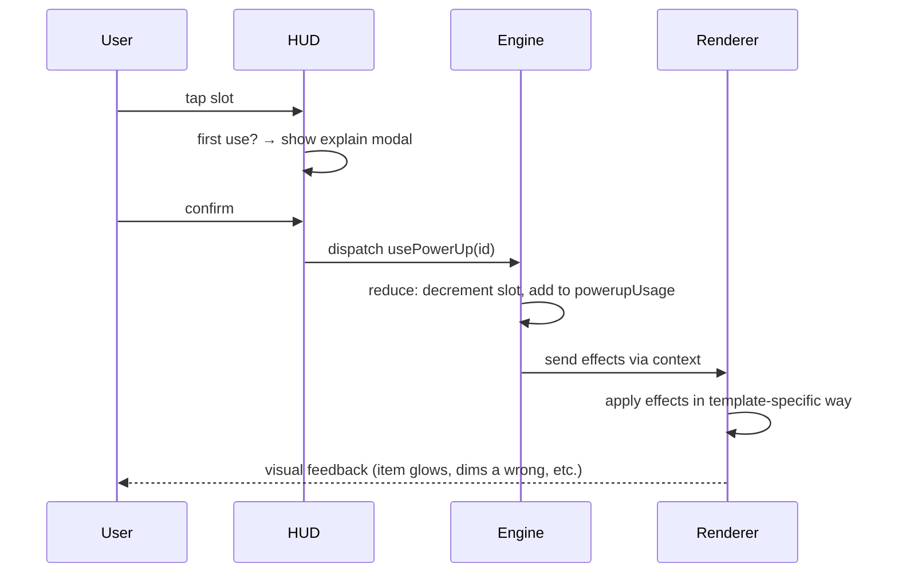

# Power-Ups

Power-ups in evo-quest are **topic-themed cognitive aids**, never
shortcuts to a score. A power-up never trivializes a question — it
*shifts* the cognitive load to a different (still pedagogical) place.
After using one, the student should leave the question knowing *more*,
not having clicked through.

---

## 1. Design principles

1. **Topic-shaped, not generic.** A power-up's name, icon, and flavor
   come from the biology — not from arcade conventions.
2. **Cognitive shift, not bypass.** "Reveal one wrong answer" still
   requires the student to choose among the rest. "Add time" lets them
   *think more*, not skip.
3. **Renewable through engagement, not purchase.** Earned via streaks,
   first-completions, palace-walk drops, daily nudges. No IAP. No grind.
4. **Three slot inventory cap.** Carrying scarcity preserves
   meaningfulness. Slots don't expand.
5. **First-use teaches.** First time activating any power-up, a brief
   modal explains it. Toggle "don't show again" included.
6. **Visually theme-matched.** When the student is studying genetics,
   the power-ups they hold reskin to genetics-themed icons. Same
   function, different visual flavor.

---

## 2. Full catalog

10 power-ups in v1. Catalog id format: `pu.<slug>`.

### 2.1 Darwin's Notebook — `pu.darwin-notebook`

- **Theme**: Evolution
- **Icon**: 📓 (a worn field notebook)
- **Function**: For one question, the engine dims one *wrong* option in
  a multiple-choice template, or removes one wrong from a match.
- **Doesn't apply to**: fill, builder templates (no discrete options)
- **Why it teaches**: Reduces choice space without solving. The student
  still must reason among the remaining.

### 2.2 Galápagos Compass — `pu.galapagos-compass`

- **Theme**: Evolution
- **Icon**: 🧭
- **Function**: Skip the current question without breaking the streak.
- **Why it teaches**: Sometimes the student isn't ready for *this*
  framing of the idea. Skipping without punishment lets them keep
  momentum and return later. The skipped unit is re-queued at the end
  of the journey for a second attempt with a different template.

### 2.3 ATP Boost — `pu.atp-boost`

- **Theme**: Cell Biology
- **Icon**: ⚡
- **Function**: Adds 30 seconds to the speed-reveal countdown (delays
  the mnemonic reveal); also extends any explicit timer in microworld
  templates by 30s.
- **Why it teaches**: Gives processing time. The hint still un-masks
  eventually; the student still must engage the prompt. ATP is the
  cell's "more time to work" — fitting.

### 2.4 Lysosome — `pu.lysosome`

- **Theme**: Cell Biology
- **Icon**: 🧹
- **Function**: After a wrong answer, "re-digest" — the question
  re-opens, the streak isn't broken, and the student gets one retry.
  Counts as wrong if they miss again.
- **Why it teaches**: Mistakes are data. The Lysosome power-up
  literalizes the debug-the-bug philosophy: re-examine what went wrong,
  try again with the same feedback in mind.

### 2.5 Punnett Predictor — `pu.punnett-predictor`

- **Theme**: Genetics
- **Icon**: 🌱
- **Function**: For one quiz, reveal a ratio/percentage hint that
  short-cuts arithmetic without revealing the concept. E.g., for a
  cross-prediction `predict-run-reflect`, shows the underlying numeric
  truth as a draggable target.
- **Why it teaches**: Removes calculation friction, keeps the
  conceptual reasoning. Useful for students whose number-sense is the
  bottleneck on understanding the biology.

### 2.6 Mendel's Pea — `pu.mendel-pea`

- **Theme**: Genetics
- **Icon**: 🟢
- **Function**: Reveals one correct morpheme in an `etymology-puppet`
  question, or reveals one root + meaning in any etymology card.
- **Why it teaches**: Morphemes are reusable cognitive parts. Revealing
  one is teaching one.

### 2.7 Mitochondrion Shield — `pu.mitochondrion-shield`

- **Theme**: Cell Biology
- **Icon**: 🛡️
- **Function**: Streak shield — the next wrong answer doesn't reset the
  streak. One-time use; consumed by the first wrong answer (or expires
  at the end of the journey).
- **Why it teaches**: Streaks are gamification, but a single hard
  question shouldn't punish a long correct streak. The shield is a
  one-time forgiveness.

### 2.8 RNA Flashback — `pu.rna-flashback`

- **Theme**: Origin of Life
- **Icon**: 🪞
- **Function**: Replay the last incorrect unit immediately with a
  different quiz template, before continuing the queue.
- **Why it teaches**: Active recall after a missed concept *cements*
  the correction. The flashback turns the wrong answer into a learning
  moment in real time.
- **Rare**: 1 per inventory max, 1 per long journey.

### 2.9 Etymology Lens — `pu.etymology-lens`

- **Theme**: Universal
- **Icon**: 🔍
- **Function**: For one question, show roots + meanings for *every*
  morpheme in the prompt, not just the key term.
- **Why it teaches**: Decomposes the prompt linguistically. The student
  reads the question with full linguistic transparency.

### 2.10 Palace Portal — `pu.palace-portal`

- **Theme**: Universal (spatial)
- **Icon**: 🌀
- **Function**: In `palace-walk`, teleport to any already-visited tile
  without spending movement.
- **Why it teaches**: Spatial reasoning shortcut for review. Useful
  when the student has cleared most of a room but a single tile
  remains far away.
- **Rare**: 1 per inventory max.

---

## 3. Catalog summary

| ID | Theme | Icon | Effect kind | Rarity |
|---|---|---|---|---|
| `pu.darwin-notebook` | Evo | 📓 | reveal one wrong | common |
| `pu.galapagos-compass` | Evo | 🧭 | skip-no-penalty | common |
| `pu.atp-boost` | Cell | ⚡ | +30s | common |
| `pu.lysosome` | Cell | 🧹 | allow-retry | common |
| `pu.punnett-predictor` | Gen | 🌱 | numeric hint | common |
| `pu.mendel-pea` | Gen | 🟢 | morpheme reveal | common |
| `pu.mitochondrion-shield` | Cell | 🛡️ | streak shield | common |
| `pu.rna-flashback` | Origin | 🪞 | immediate review | rare |
| `pu.etymology-lens` | Universal | 🔍 | full etymology | common |
| `pu.palace-portal` | Spatial | 🌀 | palace teleport | rare |

---

## 4. Acquisition

### 4.1 Streak rewards

Every multiple of 5 in the current journey's streak earns one power-up
roll. Probability table:

| Streak hit | Common pool | Rare pool |
|---|---|---|
| 5 | 100% (uniform over commons) | 0% |
| 10 | 90% common | 10% rare |
| 15 | 80% common | 20% rare |
| 20 | 70% common | 30% rare |
| 25+ | 60% common | 40% rare |

If the student's inventory is full when a roll happens, they're
prompted: "*You earned a [icon] [name]. Your inventory is full.
Replace which one?*" with an option to discard the new one or swap.

### 4.2 First-clear bonuses

Each first-clear of a Wing earns:

- One rare power-up themed for that Wing
- One common power-up themed for that Wing

Tracked on the user's progress; not repeatable.

### 4.3 Palace drops

In `palace-walk` quizzes, items on the floor include power-up tokens.
Cleared rooms always drop ≥1 power-up (themed for the Wing the room is
in). Probability of common vs rare: 90/10 baseline, +5% rare per
hidden-lore item also picked up (rewarding thorough exploration).

### 4.4 Daily nudge

If the student opens the app on a new calendar day (≥18h since their
last session), the first journey of that day earns one common power-up
on completion. The streak progression also unlocks daily-streak hidden
achievements (see [`achievements.md`](./achievements.md) §6).

### 4.5 Achievement rewards

Some hidden achievements grant a guaranteed rare:

- `hidden.bricoleur` → guaranteed `pu.palace-portal`
- `hidden.cascade-prophet` → guaranteed `pu.rna-flashback`
- `hidden.streak-15` → guaranteed `pu.mitochondrion-shield`

---

## 5. Topic-themed reskins

When a student is studying a particular Wing, the power-ups they earn
visually skew to match. Functions are identical; visuals shift.

### 5.1 Visual-only variants

Each common power-up has 3-4 visual variants:

| Function | Evolution skin | Cell Biology skin | Genetics skin |
|---|---|---|---|
| reveal-one-wrong | 📓 Darwin's Notebook | 🔬 Cell Microscope | 🌱 Mendel's Notes |
| skip-no-penalty | 🧭 Galápagos Compass | 🚪 Cell Door | 🌳 Pedigree Branch |
| add-time | ⏳ Hourglass | ⚡ ATP Boost | ⏰ Generation Wait |
| streak shield | 🦴 Fossil Shield | 🛡️ Mitochondrion Shield | 🧬 DNA Helix Shield |
| morpheme reveal | 📜 Latin Scroll | 🦠 Cell Decoder | 🟢 Mendel's Pea |
| etymology lens | 🔍 Field Lens | 🔬 Microscope | 🧐 Gene Lens |

The reskin is determined when the power-up is earned, based on the
student's recent unit history (last ~5 attempts). It's pure visual —
the underlying `id` stays consistent. The skin persists once earned;
it doesn't shift later.

This makes the inventory feel personalized to what the student is
currently learning, deepening the topic-immersion.

### 5.2 Rare power-ups

Rare power-ups (`pu.rna-flashback`, `pu.palace-portal`) have a single
canonical visual — no reskin. Their rarity is part of their identity.

---

## 6. Activation flow

When a student taps a power-up slot:



The engine never directly mutates the renderer — it provides
`PowerUpEffect` descriptors (engine.md §8) and the renderer applies
them. This keeps the engine renderer-agnostic.

---

## 7. Per-template effect mapping

Some effects only apply to certain templates. The mapping:

| Effect | Templates where it applies |
|---|---|
| `reveal-option` | `match`, `scenario`, `binaryChoice`, `debug-the-claim` (highlights bug location) |
| `skip-no-penalty` | all (re-queues to end with different template) |
| `add-time` | `speed-reveal-mnemonic`, `microworld-sandbox`, `predict-run-reflect` (extends prediction window) |
| `allow-retry` | all (one extra attempt) |
| `reveal-mnemonic-now` | `speed-reveal-mnemonic` only |
| `streak-shield` | all (passive; consumes on next wrong) |
| `reroll-question` | all (re-picks a different template for same unit) |
| `show-etymology-all` | all (expands the etymology card to show every morpheme) |
| `palace-teleport` | `palace-walk` only |

Trying to use a power-up that doesn't apply to the current template
shows a brief disabled state with explainer ("This power-up doesn't
apply here — save it for a multiple-choice question.").

---

## 8. Balance

### 8.1 Earning vs spending

The expected rate of power-up acquisition vs use should be roughly
neutral over time, slightly net-positive in the early game (so students
have aids to deploy when they need them most) and slightly net-negative
in the late game (so the inventory stays meaningful and the student
budgets).

Concrete:

- A typical 15-question journey at ~80% accuracy earns ≈1.5 commons
  (one 5-streak, sometimes a 10-streak).
- The student spends ≈1 power-up per such journey on average.
- Net ≈ +0.5 per journey, balanced by slot cap (3) and inventory
  decisions ("which to discard for a new one?").

### 8.2 First-clear vs grind

The big inventory boosts come from **first-clear Wing bonuses**. After
a student has cleared all Wings in v1 (which takes weeks of study),
they shift to maintenance income (streaks + dailies) and never
"farm" power-ups — there's nothing to grind for.

### 8.3 Asymmetry by Wing

The student starts with no power-ups. Their first session in a Wing
typically yields one or two from streaks and from clearing the first
room via `palace-walk`. Each Wing is initially under-resourced in its
own theme, which is fine — students cross-use power-ups from earlier
Wings.

---

## 9. Storage shape

```ts
type PowerUpInventory = {
  slots: Array<PowerUpInstance | null>;     // length 3, null = empty slot
  earned: number;                           // lifetime total earned
  spent: number;                            // lifetime total spent
  firstUseShown: string[];                  // power-up ids whose explain modal was shown
};

type PowerUpInstance = {
  id: string;                               // catalog id (e.g., "pu.darwin-notebook")
  acquiredAt: number;
  themedFor?: string;                       // wing id for the visual skin
  // No "level" or "stack". Each instance is one use.
};
```

Storage key: `evo-quest.v1.powerups`. Schema versioning + migrations per
[`storage.md`](./storage.md).

---

## 10. First-use explainer modal copy

When the student first activates each power-up:

| ID | Modal copy |
|---|---|
| `pu.darwin-notebook` | "**Darwin's Notebook.** Darwin filled notebooks with observations. Open it now — one wrong option will dim. The right answer is still yours to find." |
| `pu.galapagos-compass` | "**Galápagos Compass.** Sometimes the right move is to come back later. Skip this one without breaking your streak — it'll re-queue at the end with a different angle." |
| `pu.atp-boost` | "**ATP Boost.** Your cell's energy currency. Buys you 30 more seconds before the mnemonic reveals — time to think, not skip." |
| `pu.lysosome` | "**Lysosome.** The cell's recycler. Wrong answer? Re-digest it — get one retry without breaking your streak." |
| `pu.punnett-predictor` | "**Punnett Predictor.** Reveal the underlying numeric truth for this question. The biology reasoning is still yours; we'll just spare you the arithmetic." |
| `pu.mendel-pea` | "**Mendel's Pea.** Reveal one of the morphemes in this question's etymology — and the meaning that goes with it. Mendel cataloged 28,000 plants. He'd be okay with a little assistance." |
| `pu.mitochondrion-shield` | "**Mitochondrion Shield.** Streak protection: your next wrong answer won't reset your streak. One-time forgiveness." |
| `pu.rna-flashback` | "**RNA Flashback.** Replay the last unit you got wrong, with a different framing. RNA was Earth's first redo-er." |
| `pu.etymology-lens` | "**Etymology Lens.** Reveal the roots + meanings of every Greek/Latin morpheme in this question. The language is the lesson, when you can see it." |
| `pu.palace-portal` | "**Palace Portal.** In Palace Walk, teleport to any tile you've already visited. Spatial cognition is older than language — use it." |

Each modal has a single button: "Use it now" + a "Don't show this again"
checkbox (defaulted to checked).

---

## 11. Anti-patterns

- **Pay-to-progress**: forbidden. No money flow ever.
- **"Auto-solve"**: no power-up reveals the correct answer outright.
  The closest is `pu.darwin-notebook` (removes one wrong) and
  `pu.punnett-predictor` (reveals a number, not a concept).
- **Pressure-driven scarcity**: no "running out of power-ups blocks
  progress." Power-ups are aids, never gates.
- **Visual decoration with no function**: a power-up that's "cool but
  doesn't really do anything" undermines the system. Every catalog
  entry has a concrete effect.
- **Generic stat boosts**: no "+10% score multiplier" or "+1 streak per
  correct." Power-ups shift cognition, not numbers.

---

## 12. Adding new power-ups

To add a new power-up:

1. Add to `src/engine/powerups/catalog.ts` with id, theme, icon
   variants, effects, rarity
2. Implement effects in `src/engine/templates/<kind>.tsx` if a new
   effect kind is needed
3. Add a first-use explainer modal entry
4. Add a row to the catalog table in this doc
5. Update [`achievements.md`](./achievements.md) §6 if it's part of
   a hidden achievement reward
6. Don't change existing power-up ids — they're in user inventories
