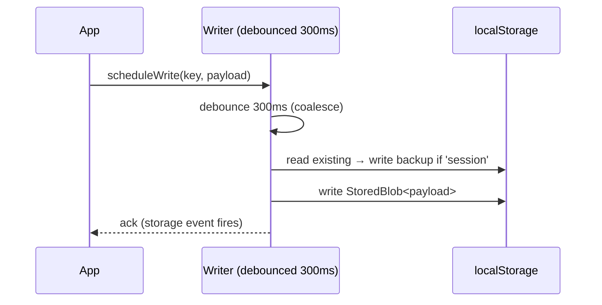
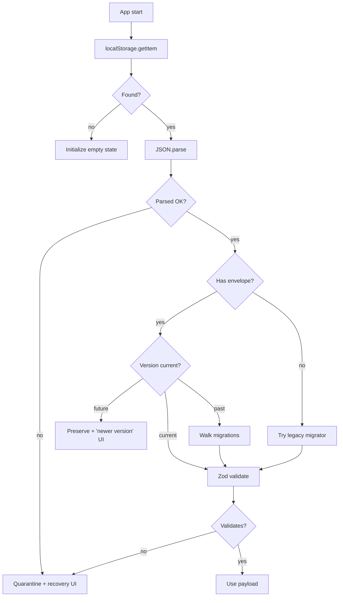

# Storage & Resume

The non-negotiable invariant: **the student never loses progress**.
Everything in this file is in service of that single property.

This doc is the contract. [`testing.md`](./testing.md) defines the
property-test suite that enforces it; `AGENTS.md` (in the repo root once
scaffolded) restates these as guardrails for future automated changes.

---

## 1. Storage substrate

| Layer | Used for | Capacity |
|---|---|---|
| `localStorage` | hot state (session, settings, units, morphemes, achievements) | ~5 MB |
| `IndexedDB` | cold state (journey log past 500 entries, artifacts past 200) | gigabytes |
| `sessionStorage` | not used | — |
| cookies | not used | — |

Why localStorage primarily: synchronous read at app boot is essential for
preventing FOUC during hydration of the home grid + Resume nudge.

IndexedDB access is async, batched, never blocks the main loop. Read on
mount via a worker (or, in v1, a `requestIdleCallback`).

---

## 2. Storage key catalog

All keys are prefixed `evo-quest.v1.*`. The version prefix lets us ship
`v2` someday alongside `v1` without conflict.

| Key | Wraps | Description |
|---|---|---|
| `evo-quest.v1.session` | `Session` | Active in-progress journey (autosaved) |
| `evo-quest.v1.session.backup` | `Session` | One-back rotation of session (last good save) |
| `evo-quest.v1.journeys` | `Journey[]` | Completed journeys (cap 500; older rolls to IDB) |
| `evo-quest.v1.units` | `Record<unitId, UnitProgress>` | Per-unit aggregate progress |
| `evo-quest.v1.morphemes` | `Record<morphemeId, MorphemeProgress>` | Per-morpheme touched state |
| `evo-quest.v1.notebook` | `LabArtifact[]` (cap 200) | Saved constructionist artifacts |
| `evo-quest.v1.modules` | `{ enabledIds, userModules }` | Content module toggles + imports |
| `evo-quest.v1.settings` | `Settings` | All settings |
| `evo-quest.v1.powerups` | `PowerUpInventory` | Power-up inventory |
| `evo-quest.v1.calibration` | `CalibrationRecord[]` | Self-debug-confidence log (append-only) |
| `evo-quest.v1.corrupt` | `{ key, blob, detectedAt, reason }[]` | Quarantined corrupted blobs |
| `evo-quest.v1.firstRun` | `{ completedAt? }` | Onboarding completion marker |

Type definitions in [`data-model.md`](./data-model.md).

---

## 3. The StoredBlob envelope

Every blob is wrapped before write, unwrapped on read:

```ts
type StoredBlob<T> = {
  schemaVersion: number;
  savedAt: number;                 // ms epoch
  appVersion: string;              // package.json version at save time
  payload: T;
};
```

Reading a key without an envelope is treated as legacy data: route
through legacy migrators (see §6) or quarantine.

---

## 4. Save flow



Rules:

- Writes are **always** through `src/storage/writer.ts`
- The writer is debounced (300ms by default) but **also** flushes on:
  - `visibilitychange` to `hidden` (page background or tab close)
  - `beforeunload`
  - Explicit `flushNow()` before navigation away from `/play`
- For the active session, the previous value rotates to `.backup` so a
  crash mid-write doesn't destroy the prior known-good state
- The writer never writes a `payload` of `undefined`. If logic produces
  one, that's a bug; the writer throws in dev and no-ops in prod (logged
  as a crash report if opt-in)

---

## 5. Load flow



The key property: **no path silently wipes data**. Every failure either
quarantines (`evo-quest.v1.corrupt`) or surfaces a recovery UI, with the
original bytes preserved.

---

## 6. Migration framework

`src/storage/migrations.ts`:

```ts
type Migration<From = unknown, To = unknown> = {
  fromVersion: number;
  toVersion: number;
  forward: (oldPayload: From) => To;
  describe: string;                // human-readable: "Add 'tier' to UnitProgress"
};

type MigrationChain = Migration[];

export const MIGRATIONS: Record<StorageKey, MigrationChain> = {
  'evo-quest.v1.session': [
    { fromVersion: 1, toVersion: 2,
      describe: "Rename 'ci' (current index) to 'currentIndex'",
      forward: (p) => ({ ...p, currentIndex: p.ci, ci: undefined }) },
    // ...
  ],
  'evo-quest.v1.units': [ /* ... */ ],
  // one chain per storage key
};

export const LATEST_VERSIONS: Record<StorageKey, number> = {
  'evo-quest.v1.session': 2,
  'evo-quest.v1.units': 1,
  // ...
};
```

Rules:

- Migrations are **append-only**. Never modify a shipped migration's
  `forward` function.
- A migration must be **pure** (no side effects) — same input always
  produces same output.
- A migration `forward` should be **lossless when possible**: prefer
  setting defaults on new fields over dropping data.
- After every migration step, the result must validate against the
  intermediate schema version (we ship one Zod schema per version
  intermediate; see §7).
- The migration chain must be **continuous**: no gaps in version numbers.
- A version skip can be added with a no-op migration if a deprecation
  pass is needed.

---

## 7. Intermediate schemas

Each storage key keeps every historical Zod schema. The chain runs:

```ts
const stages = [
  { v: 1, schema: SessionSchemaV1 },
  { v: 2, schema: SessionSchemaV2 },
];

function migrate(blob: StoredBlob<unknown>, key: StorageKey) {
  let current = blob.payload;
  let v = blob.schemaVersion;
  while (v < LATEST_VERSIONS[key]) {
    const m = MIGRATIONS[key].find((x) => x.fromVersion === v);
    if (!m) throw new MissingMigrationError(v);
    current = m.forward(current);
    v = m.toVersion;
    const stage = stages.find((s) => s.v === v)!;
    stage.schema.parse(current);   // post-migration sanity check
  }
  return current;
}
```

A `MissingMigrationError` triggers quarantine, **not** wipe.

---

## 8. Quarantine

Quarantine moves a problematic blob to `evo-quest.v1.corrupt` and
appends an audit row:

```ts
type QuarantineEntry = {
  key: string;                     // original storage key
  blob: string;                    // raw JSON (or '{}' if even reading failed)
  reason: 'parse-fail' | 'missing-migration' | 'validation-fail' | 'future-version';
  detectedAt: number;
  appVersion: string;
  zodErrors?: string[];            // serialized Zod issue paths
};
```

The corrupt key is itself a `StoredBlob<QuarantineEntry[]>` and has its
own migration chain (it has to outlast every other key).

A quarantine entry is **never** removed automatically. The recovery UI
offers explicit deletion.

---

## 9. Recovery UI

When any quarantine occurs during load, the app routes to
`/welcome?recover=1`. The page shows:

```
┌─ Something Looks Off ──────────────────────────┐
│  Some saved data doesn't fit this version.     │
│  Nothing has been lost.                        │
│                                                │
│  [ View the data (read-only) ]                 │
│  [ Download a backup (.json) ]                 │
│  [ Try to import a working backup ]            │
│  [ Continue with empty state                   │
│     (keeping the older data safely) ]          │
│  [ Permanently delete + start fresh           ]│
│       (requires typing "delete all my data")   │
└────────────────────────────────────────────────┘
```

Buttons:

- **View**: a `<pre>` showing the raw JSON, with a copy-to-clipboard.
- **Download**: triggers a `Blob` download named
  `evo-quest-corrupted-<key>-<date>.json`.
- **Import**: opens the import flow; replaces the corrupted state if
  the imported blob validates.
- **Continue with empty state**: blanks the *runtime* state for that key
  (e.g., empty journeys array), preserving the quarantined blob for
  later recovery.
- **Delete**: requires typing the explicit phrase. Removes everything
  including the quarantined entry.

---

## 10. Future-version handling

A blob from a newer app version (e.g., the user opened a deployed v1.4
app in their browser, then later opens an older v1.2 build) is
detected by `schemaVersion > LATEST_VERSIONS[key]`.

We do not attempt backwards migration (impossible without future code).
Instead:

1. Preserve the blob untouched.
2. Show a banner: "*Your saved data is from a newer version. Some
   recent features may not be available here. Refresh to check for an
   update.*"
3. Load whatever subset validates against the current schema (best-
   effort decode).
4. Block all writes to that key until either the app upgrades or the
   user explicitly accepts the downgrade (which clones the blob to
   `.backup` and writes a current-version version).

---

## 11. Active session — autosave cadence

The active journey (`evo-quest.v1.session`) is the most critical key
because losing it loses real, in-the-moment work.

Cadence:

- Every state change (answer, hint reveal, drag, slider move) triggers a
  scheduled save through the debounced writer
- Debounce is **300ms**
- Hard flush on: tab hidden, beforeunload, navigation away from `/play`,
  explicit "Pause / End" button press

Crash worst-case: ~300ms of in-flight interactions, almost always
inside one question that the student is mid-thinking on.

The session is **wrapped** with a one-back backup (`session.backup`)
that always holds the previous successful save. On load, if `session`
fails validation, we automatically try `session.backup` before
quarantining either.

---

## 12. Rotation: keeping localStorage healthy

Two keys grow over time and must rotate to IndexedDB:

- `evo-quest.v1.journeys` capped at 500 entries (~50-200 KB depending on
  content). Older entries move to IDB store `journeys-archive`. The
  Journeys page reads the latest 500 from LS and lazy-pages older from
  IDB on scroll.
- `evo-quest.v1.notebook` capped at 200 artifacts. Older roll to IDB
  store `notebook-archive`.

Rotation happens on append (synchronously rebuild the array, defer the
IDB write). No data ever silently disappears.

---

## 13. Export / import

### Export

`/settings → Data → Export All` builds:

```ts
type ExportEnvelope = {
  formatVersion: 1;                // export format, separate from per-key versions
  exportedAt: number;
  appVersion: string;
  storageKeys: Record<string, unknown>;     // every evo-quest.v1.* key, raw
  archivedJourneys?: Journey[];    // pulled from IDB
  archivedArtifacts?: LabArtifact[];
};
```

Saved as `evo-quest-export-<YYYY-MM-DD>.json`. Always includes
archived (IDB) data so the export is genuinely complete.

### Import

`/settings → Data → Import`:

1. Parse JSON; validate against `ExportEnvelopeSchema`
2. For each per-key blob, run through the migration chain to current
3. If any fail, show a summary with per-key status
4. On user confirm: replace all current keys; clear and restore IDB
   archive stores
5. Reload the app

Pre-import, the **current state is exported first** to a hidden
`evo-quest.v1.preImportBackup` key so an accidental import can be
reversed by re-importing the auto-backup.

---

## 14. Hard reset

`/settings → Data → Hard Reset`:

1. Modal: "Type `delete all my data` to confirm."
2. On confirm: remove every `evo-quest.v1.*` localStorage key; delete
   IDB database `evo-quest`.
3. Reload to `/welcome` first-run flow.

No silent partial reset. All or nothing.

---

## 15. AGENTS.md draft

The repo's root `AGENTS.md` (to be written when the project scaffolds)
restates the storage contract as guardrails for any automated change.
Draft text:

```
# AGENTS.md — Storage & Resume Invariants

This file enforces the non-negotiable invariants that protect a real
user's saved state. Read before modifying any code under `src/storage/`
or any storage-touching code in `src/engine/`.

## Hard rules

1. NEVER delete or rename a localStorage key under `evo-quest.v1.*`.
2. NEVER remove a field from a stored type. Deprecate by leaving it
   optional and ignored.
3. NEVER reuse a removed field name for a different purpose.
4. NEVER reuse a retired ID (KnowledgeUnit, Morpheme, Achievement,
   etc.). Add aliases instead.
5. NEVER modify a shipped migration. Migrations are append-only and
   pure.
6. NEVER silently wipe data on a parse / validation / version mismatch.
   The only paths are: migrate forward, quarantine, or preserve-and-warn.
7. EVERY new storage key must:
   - Start with `evo-quest.v1.`
   - Use `StoredBlob<T>` envelope
   - Have a `LATEST_VERSIONS[key]` entry
   - Have a (possibly empty) `MIGRATIONS[key]` entry
   - Have a Zod schema in `src/storage/schema.ts`
   - Have an entry in the invariant test suite
8. EVERY new field on a stored type must come with a migration that
   sets a default for existing data. The migration's `describe` must
   be human-readable.

## Required tests

When changing storage code, the following test suites must continue to
pass without modification:

- `src/storage/__tests__/resume.invariant.test.ts`
- `src/storage/__tests__/migrations.invariant.test.ts`

If a test must change, the change should add new property-based
assertions, never relax existing ones.

## Review checklist

Before merging a storage-touching PR:

- [ ] New keys are namespaced and registered in all required places
- [ ] Migrations are pure and reversible-in-principle (preserve data)
- [ ] No shipped migration was modified
- [ ] No ID was reused
- [ ] Tests demonstrate that old-version blobs still load correctly
- [ ] Tests demonstrate that intentional corruption triggers quarantine
- [ ] `data-model.md` and `storage.md` are updated if any contract
      changed
```

---

## 16. Open design choices

These are decisions to confirm during scaffolding:

- **IDB library**: raw IDB or `idb` (the small typed wrapper)? Default
  pick: `idb` for ergonomics + small bundle hit.
- **Compression**: not in v1; user state is small. Reconsider if any
  user state exceeds 1 MB.
- **Encryption at rest**: not in v1; the user owns the device and the
  storage. Local-first means the device's encryption is the device's
  responsibility.
- **Multi-tab sync**: storage events propagate writes to other open
  tabs; we listen in dev to surface a "another tab made changes" toast.
  Active-session writes from a second tab block until the first tab
  releases.
